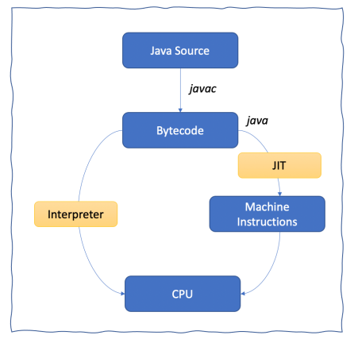

# Java의 장점
- Write Once Run Anywhere - 플랫폼에 독립적이다.
- 안전한 메모리 관리 시스템을 갖고 있다.
- 런타임에 핫 코드를 감지하고 최적화할 수 있다.
- 표준 API, 서드 파티 라이브러리 등을 활용해 개발 생산성을 높일 수 있다.

# Java의 역사
- 1991 : Green 프로젝트 (Oak 언어의 탄생)
- 1995 : Java로 명칭 변경
- 1996 : JDK 1.0 출시
- 1999 : HotSpot VM 출시
- 2004 : JDK 5 출시 (오토박싱, 제네릭스, 동적 애너테이션, 열거형, foreach 등)
- 2014 : JDK 8 출시 (람다식 지원, 시간/날짜 API 추가, PermGen 제거)
- 2018 : Java EE 소유권을 이클립스에 넘기면서, Java라는 상표를 쓰지 못하고 Jakarta EE로 이름을 바꿈. JDK 11 출시 (ZGC 실험 버전)
- 2019 : JDK 12 출시 (셰넌도어 GC)
- 2021 : JDK 16 출시 (instanceof 패턴 매칭, 레코드 클래스 도입)
- 2023 : JDK 21 출시 (세대 구분 ZGC, 가상 스레드 도입)

# JVM 제품군
## HotSpot VM
### 실행 방식
인터프리터 방식과 JIT 컴파일 방식을 혼용한다.
- 인터프리터 방식
  - 대부분의 코드는 인터프리터가 바이트코드를 직접 해석하며 실행한다.
  - (인터프리터) 바이트코드 해석 -> (실행 엔진) 네이티브 메서드 호출
  - 인터프리터의 해석, 네이티브 메서드 호출 과정이 있기 때문에, 기계어를 직접 실행하는 것보다 CPU를 더 많이 사용한다.

- JIT 컴파일 방식
  - JIT 컴파일이라는 개념 자체는, 자바보다 훨씬 이전부터 있었다. (LISP 언어)
  - HotSpot VM의 성공으로, 현대 프로그래밍 언어의 중요한 개념이 되었다. (JS의 V8 엔진, Python의 PyPy 구현체 등)
  - 런타임에 자주 실행(메소드 호출 횟수, 루프 반복 횟수)되는 코드만 기계어로 컴파일한다.

### hot code detection
- hot code detection
  - 자주 호출 or 많이 반복되는 순환문을 런타임에 탐지
- JIT 컴파일
  - 탐지된 코드를 기계어로 컴파일
- OSR (On-Stack Replacement)
  - 실행 중인 코드를 컴파일된 기계어로 교체
  - 실행 중인 인터프리터 스택 프레임을 JIT 컴파일된 기계어의 스택 프레임으로 교체

## BEA JRockit
- 서버 애플리케이션에만 집중해서, 구동 시간이 오래 걸리는 단점이 있다.
- 인터프리터를 제거하고, 전체 코드를 JIT 컴파일러로 컴파일한다.

## IBM J9
- 모듈화(클래스 로더, 실행 엔진, 메모리 관리자, 모니터링 등)가 잘 되어있다.
- JVM 기술 학습 목적으로는 HotSpot보다 OpenJ9이 좀 더 권장된다.

## GraalVM
- 다양한 언어를 지원하는 cross-language VM이다.
  - 소스 코드(or 컴파일된 중간 형식)를 IR(Intermediate Representation)으로 변환한다.
  - IR을 최적화하고, 런타임에 JIT 컴파일을 해서, 네이티브 컴파일러보다 성능이 좋을 수 있다.
- Graal 컴파일러의 성능이 HotSpot(C2 컴파일러)보다 좋다고 평가되고 있다.