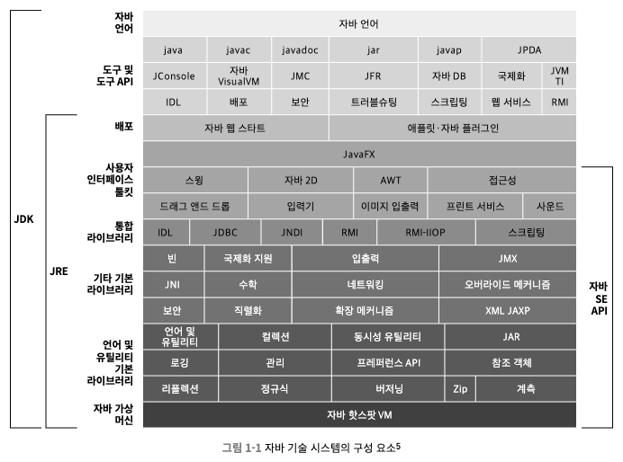
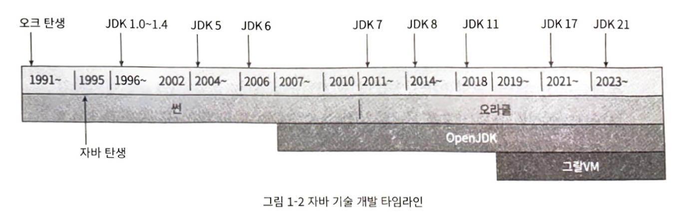

# 1장. 자바 기술 시스템 소개

> 자바 기술 시스템의 과거, 현재, 미래 개발 흐름
Open JDK 17을 직접 컴파일하는 방법

# 1.1 들어가며

- **자바**
    - 엄격한 구조를 갖춘 객체 지향 프로그래밍 언어
    - “한 번 작성하면 어디서든 실행된다”
    - 상당히 안전한 메모리 관리 시스템
    - 런타임에 핫 코드를 감지, 컴파일하고 최적화
    - 표준 API 자체가 풍부
    - 다양한 서드 파티 라이브러리

# 1.2 자바 기술 시스템

- **JDK**
    - 자바 프로그래밍 언어, 자바 가상 머신, 자바 클래스 라이브러리

- 자바 기술 시스템의 구성 요소와 JDK, JRE의 범위

# 1.3 자바의 과거와 현재

- JDK 타임라인

- **1995년:** 자바 데뷔
- **2002년:** 마이크로소프트 닷넷(.NET) 프레임워크의 등장
- **2004년:** JDK 5 - 오토박싱, 제네릭스, 동적 애너테이션, 열거형, 가변 길이 매개 변수, foreach 순환문 등의 문법 변화 /  가상 머신과 API 수준에서는 자바 메모리 모델, java.util.concurrent 패키지가 도입
- **2006년:** JDK 6
    - 스크립트 언어 지원(모질라 자바스크립트 라이노 엔진 내장)
    - 컴파일타임 애너테이션 처리기
    - 마이크로 HTTP 서버 API 제공
    - 자바 가상 머신: 락(lock)과 동기화 구현 / 가비지 컬렉션, 클래스 로딩 등 많은 면에서 개선
- **2009년:** JDK 7
    - 업데이트 4부터 자바 SE의 핵심 기능을 맥OS에서도 공식 지원
    - 업데이트 6부터는 모든 기능이 호환,  ARM 아키텍처도 지원
    - 윈도우(윈도우 9x 제외), 리눅스, 맥OS - ARM, x86, x86-64
    - 윈도우 XP를 지원하는 마지막 버전
- **2014년:** JDK 8
    - JEP 126: 람다식 지원(자바 언어로 함수식을 매끄럽게 표현
    - JEP 104: 나스혼(Nashorn: 코뿔소) 자바스크립트 엔진 내장
    - JEP 150: 새로운 시간 및 날짜 API
    - JEP 122: 핫스팟에서 영구 세대 완전 제거
- **오라클:** JDK 3년 지원 철학 폐지 → 매 6번째 메이저 JDK만이 LTS 버전
    - LTS 버전만이 3년간 지원과 업데이트를 받을 수 있음
    - 그 외 버전들은 겨우 6개월 이라는 짧은 시한부 인생
- **2018년:** JDK 11
    - JEP s17개 추가
    - 혁신적인 가비지 컬렉터인 ZGC의 실험 버전 추가
    - JDK 10 때 등장한 타입 추론의 랍다 구문 지원
    - OpenJDK 11과 오라클 JDK 11의 코드 및 기능이 완전히 같아짐
- **2019년:** JDK 12 - 셰년도어 가비지 컬렉터 등장
- **2023년:** JDK 21 - 17 대비 37개 JEP 추가, 세대구분 ZGC, 가상 스레드 도입

# 1.4 자바 가상 머신 제품군

- **가상 머신의 조상: 썬 클래식 VM과 이그잭트 VM**
    - 당시 인터프리터와 컴파일러는 함께 구동되지 않았음
    - 컴파일러를 사용하기 시작하면 '코드 전체'를 컴파일해야 했다.
      (실행 빈도 등 컴파일에 따른 득실과 상관없이)
    - = 자바는 느리다
- **핫스팟 VM**
    - 1인자, 오라클 JDK와 OpenJDK의 공동 가상 머신
    - 핫코드 감지 기술: 컴파일했을 때 효과를 가장 크게 볼 수 있는 코드 영역을 런타임에 알아내어 JIT 컴파일러에 알림 → JIT 컴파일러가 해당 코드를 메서드 단위로 컴파일
    - 온스택 치환(OSR): 런타임에 스택을 치환하는 기술
    - 컴파일러와 인터프리터가 조화롭게 협력해 프로그램 응답 속도와 실행 성능 사이의 균형을 잡아 줌
- **BEA 시스템의 JRockit과 IBM의 J9**: 세계 3대 상용 자바 가상 머신’이라 불리던 두 경쟁자
- 특정 하드웨어 플랫폼에서만 구동되는 ‘소프트웨어와 하드웨어가 통합’된 형태의 가상 머신도 있음
- 독점 가상머신은 점차 쇠퇴
- **징 VM**
    - 정의 PGC와 C4 컬렉터는 수TB의 자바 메모리를 지원 & 일시 정지 시간을 10밀리초 이하로 통제
    - 핫스팟은 ZGC와 셰넌도어 컬렉터를 선보이기 전까지 이 수준에 도달할 수 없었음
    - 징에 내장된 기능: 실행 중 핫스팟 찾기, 객체 함당 모니터링, 락 경합 모니터링
    - 일반 사용자에게도 낮은 지연 시간, 빠른 예열(waring up) 시간, 쉬운 모니터링 등의 혜택
- **TCK 호환성 테스트**: 어떤 운영 플랫폼을 “자바 기술 시스템과 호환된다”라고 내세우고 싶다면 통과해야 함
- 안드로이드는 썬이 상상하지 못한 방식으로 자바 언어를 모바일 기기에 안착시켰음
- 이외 마이크로소프트와 자바의 싸움, 메타순환 가상머신 등…

# 1.5 자바 기술의 미래

> 자바의 쇠퇴? 자바 언어 자체보다는 기반 기술이 중요

- **그랄VM**
    - **자바 언어나 핫스팟 가상머신이 완벽하게 대체된다는 가정에 있어 가장 유력한 후보**
    - 핫스팟 가상 머신 위에 구축된 크로스 언어(cross-language) 풀 스택 가상 머신
      / 물리 머신에 대응하는 고수준 언어 가상 머신
    - 자바 가상 머신 언어들은 물론 LLVM 기반 컴파일러를 사용하는 C•C++, 러스트 같은 언어들, 그 외 자바스크림트, 루비, 파이썬, R, 웹어셈블리도 지원 - 추가 비용 없이 이 언어들을 혼합해 사용
    - 입력된 중간 표현을 자동으로 최적화 / 런타임에 JIT 컴파일 → 네이티브 컴파일러보다 나을 수 있음

- **JIT 컴파일러**
    - 핫스팟 가상머신 - 클라이언트 컴파일러, 서버 컴파일러, 인터프리터
    - 클라이언트 컴파일러: 컴파일 속도는 빠르지만 적은 최적화
    - 서버 컴파일러: 컴파일 속도는 느리지만 더 많은 최적화
    - JDK 10에서 추가 - 그랄 컴파일러 (C2 컴파일러 대체 용도)
    - AOT 컴파일: 애플리케이션을 실행하기 전에 미리 네이티브 코드로 컴파일 > 런타임 대응 어려움

- **네이티브**
    - 장기간 실행할 필요가 없거나 크기가 작은 어플리케이션에 불리
    - MSA와 맞지 않는 추세, 구동시간 긺 / 최고 성능을 위한 예열 필요

- **서브스트레이트 VM(Substrate VM)**
    - 그랄 VM의 한 요소
    - 사전 컴파일된 네이티브 코드를 핫스팟 가상 머신 없이 실행하는 기술
    - 독자적인 예외 처리, 스레드 관리, 메모리 관리, 자바 네이티브 인터페이스(이하 JNI) 접근 메커니즘 등
    - 극히 작은 런타임 환경
    - Node.js (20MB) vs Substrate VM 4.2MB
    - 오라클은 자체 데이터베이스에 그랄VM을 내장 - 저장 프로시저를 작성 (Not PL/SQL)

- **꾸준한 모듈화로 J9와 비슷해진 핫스팟 가상머신**

- **언어/문법 개선**
- JDK 7의 코인 프로젝트가 완료된 후 자바 커뮤니티는 또 다른 언어 기능 개선 프로젝트인 앰버 60 를 발족
    - **JDK 10 이후 정식 표준이 된 구문 개선**
        - 286: Local-Variable Type Inference - 지역 변수 타입 추론(var), JDK 10에 도입
        - 323: Local-Variable Syntax for Lambda Parameters - 람다식 매개 변수로 사용할수 있도록 지역 변수 구문 개선, JDK 11에 도입
        - 361: Switch Expressions- switch 문을 표현식으로 사용할 수 있는 문법 추가, JDK 14에 도입
        - 378: Text Blocks -+ 없이 문자열 여러 줄을 쉽게 표현할 수 있는 문법 추가, JDK 15에 도입
        - 394: Pattern Matching for instanceof - 패턴 매칭 능력을 부여해 instanceof 연 산자의 표현력 강화, JDK 16에 도입
        - 395: Records- 데이터 전달용 불변 클래스인 레코드 타입 추가, JDK 16에 도입
        - 409: Sealed Classes- 자신을 확장하거나 구현할 수 있는 클래스와 인터페이스를 제한하는 봉인된 클래스와 봉인 인터페이스 타입 추가, JDK 17에 도입
        - 440: Record Patterns - 레코드 클래스로부터 데이터를 가져올 때 패턴 매칭 제 공, JDK 21에 도입
        - 441: Pattem Matching for switch- switch 문·표현식의 패턴 매칭 능력 개선, JDK 21에 도입
    - **진행 중 개선안**
        - 430: String Templates (Preview) - 리터럴 텍스트를 임베디드 표현식 및 템플릿 프로세서와 결합하여 특수한 결과를 생성할 수 있게 해서 자바의 기존 문자열 리터럴과 텍스트 블목을 보완, JDK 21에 포함
        - 443: Unnamed Pattems and Variables (Preview)- 언더스코어()를 이용하여 무 명 패턴과 무명 변수 작성 지원, JDK 21에 포함
        - 445: Unnamed Classes and Instance main methods (Preview)- 클래스•패키지• 모듈 정의를 생략할 수 있는 무명 클래스와 단순화한 main() 메서드 도입, JDK 21에 포함
        - 447: Statements before super() (Preview) - 인스턴스를 참조하지 않는 문장은 this()나 super() 호출 전에 작성 가능

# 1.6 실전: 내 손으로 빌드하는 JDK

- 컴파일에 필요한 서드파티 라이브러리 / 빌드 도구: P47
- OpenJDK가 제공하는 유용한 컴파일 매개 변수들: P49
- 부트 JDK: 자바 코드 컴파일을 위한 또 다른 JDK, 직전 메이저 버전이 원칙. 동일 가능
- 디버깅
    - 핫스팟 가상 머신을 디버깅용 / 심벌 정보를 포함해 빌드
    - 명령줄에서 곧바로 GDB 디버깅 가능
    - CLion을 통해 통합 개발 환경에서 디버깅도 가능
    - 인터프리터 디버깅 매개변수: 핫스팟 제공 - -XX: +TraceBytecodes -XX:StopInterpreterAt=<n>

- 실제 빌드한 모습