# 2.1 들어가며

- **메모리 관리 측면**
    - **C·C++ 개발자**: 전권을 가진 황제인 동시에 잡다한 막노동도 직접 하는 일꾼
    - **자바 개발자**
        - 통제권을 위임: 골치 아픈 메모리 관리를 가상 머신이 해 줌
        - 문제가 한번 터지면 가상 머신의 메모리 관리 방식을 이해하지 못하는 한 해결하기가 상당히 어렵다

# 2.2 런타임 데이터 영역

> JVM이 자바 프로그램을 실행하는 동안 필요한 메모리로 나눠 관리하는 몇 개의 데이터 영역
>

- 이 영역들은 각각 목적과 생성/삭제 시점이 다름

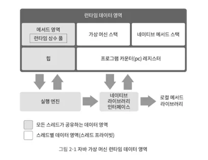

## 프로그램 카운터 레지스터

- 작은 메모리 영역, 현재 실행 중인 스레드의 바이트코드 줄 번호 표시기
- **바이트코드 인터프리터**: 카운터의 값을 바꿔 다음에 실행할 바이트코드 명령어를 선택하는 식으로 동작
- **자바 가상 머신에서의 멀티스레딩**
    - CPU 코어를 여러 스레드가 교대로 사용하는 방식으로 구현
    - → 멈춘 지점을 정확하게 복원해야 함
- **스레드 프라이빗 메모리**
    - 스레드 각각에는 고유한 프로그램 카운터가 필요
    - 스레드의 카운터는 서로 영향을 주지 않는 독립된 영역에 저장
- **프로그램 카운터**
    - 자바 메서드 실행 시, [해당 바이트 코드 명령어의 주소]가 프로그램 카운터에 담김
    - 네이티브 메서드 실행 시, [Undefined]기 담겨 있음
- **OOM이 정의되지 않은 유일한 영역**

## 자바 가상 머신 스택

- 스레드 프라이빗 (Like PC)
- 스레드와 생명 주기가 동일 (생성-삭제 시기 동일)
- JVM이 **스택 프레임**을 Push-Pop하는 공간
    - JVM은 메서드 호출 시 **스택프레임을 만들어 정보를 저장**함
    - JVM은 스택 프레임을 가상 머신 스택에 푸시 → 메서드가 끝나면 Pop
- **스택 프레임**
    - 지역변수 테이블, 피연산자 스택, 동적 링크, 메서드 반환 값 등의 정보를 저장
    - 메서드 실행 도중 사용되는 아주 기본적인 데이터 구조 (8장 설명 예정)

---

- **자바의 메모리 영역**
    - 힙과 스택으로 양분하기에는 복잡함
    - 그러나 두 가지가 객체 메모리 할당과 가장 밀접 / 개발자들이 가장 신경 써야 할 영역인 것은 사실
- **지역변수 테이블**
    - 자바 가상 머신이 컴파일타임에 알 수 있는 다양한 기본 데이터 타입, 객체 참조, 반환 주소 타입 저장
    - 자바 가상 머신 스택: 일반적으로 외부에서 “스택”이라고 여겨지는 것
        - 그중 특히 해당 지역 변수 테이블이 그 정의와 주로 부합함
    - 지역변수 테이블에 필요한 데이터 공간은 컴파일 과정에서 할당됨
        - 자바 메서드: 스택 프레임에서 지역 변수용으로 할당받아야 할 공간의 크기가 이미 결정됨
        - 이후 런타임에 절대 변하지 않음
- **지역 변수 슬롯**
    - 지역변수 테이블내에서 **[데이터 타입]**을 저장하는 곳
    - 개당 32비트 → double은 2개, 나머지는 1개 슬롯에 저장됨
- **발생 가능한 Error**
    - 자바 가상 머신 스택에서 2가지 정의함
    - `StackOverFlowError`: 스레드가 요청한 스택 깊이가 가상 머신이 허용하는 깊이보다 클 때
    - `OutOfmemoryError`
        - 동적으로 스택 용량을 확장할 수 있던 클래식 VM에서 나오던 오류
        - 스택을 확장하려는 시점에 여유 메모리가 충분하지 않을 시 발생

## 네이티브 메서드 스택

- 가상 머신 스택과 매우 비슷한, 그냥 네이티브 메서드를 실행할 때 사용하는 스택
- 자바 가상 머신 명세에 규칙이 없음: 가상 머신 구현자가 원하는 대로 구현하면 됨
- 따라서 두 가지 스택을 합쳐 둔 VM도 있음 (핫스팟 머신 포함)
- 가상 머신 스택과 동일 에러 발생: `StackOverFlowError` / `OutOfmemoryError`

## 자바 힙

- **자바 애플리케이션이 사용할 수 있는 가장 큰 메모리**
- **모든 스레드가 공유**
- **가상 머신이 구동될 때 만들어짐**

---

- **자바 가상 명세 왈,** 모든 객체 인스턴스와 배열이 이 영역에 할당된다.
- **'거의'** 모든 객체 인스턴스 가 이 영역에 할당?
    - 거의인 이유: 값 타입도 지원할 것으로 보임
    - 당장만 생각하더라도 JIT 컴파일 기술이 발전하면서, 특히 탈출 분석 기술이 날 로 발전하면서 스택 할당과 스칼라 치환 최적화 방식이 살짝 달라졌다.  → ?? 11장에 나온다고 함.
- **세대별 컬렉션 이론(generational collection theory)**
    - **현대적인 가비지 컬렉터가 기준**으로 설계했던 것 (신세대 / 구세대 / 영구세대 …)
    - 가비지 컬렉터들의 일반적인 특성 또는 설계 방식
    - 반드시 이 형태로 메모리를 구성해야 한다는 뜻은 아님 ⇒ 자바 명세에는 이야기 자체가 없음
    - 잠차 이러한 세대 구분이 멀어지는 중 - 핫스팟에도 해당 설계를 따르지 않는 컬렉터가 포함됨
- **메모리 할당 관점에서 자바 힙은 모든 스레드가 공유**
    - **스레드 로컬 할당 버퍼 여러 개**로 나뉨 ⇒ 오직 객체 할당/회수 효율을 높이고자 하는 목적
    - 그러나 달라지지 않는 것: **객체의 데이터, 즉 인스턴스를 저장**
    - **자바 가상 명세 왈,** 자바 힙은 물리적으로 떨어진 메모리에 위치해도 상관없으나 **논리적으로는 연속**되어야 한다.
    - 파일 시스템과 동일
    - 주로 큰 객체는 물리적으로도 연속 공간을 사용하도록 함 (구현 로직 단순화 / 저장 효율화)
- **자바 힙은 크기를 고정할 수도, 확장할 수도 있게 구현할 수 있다.**
    - 요즘 주류 가상 머신들은 모두 확장 가능한 형태로 구현됨
- **발생 가능한 Error**
    - `OutOfMemoryError`: 새로운 인스턴스에 할당해 줄 힙 공간이 부족 / 힙을 더는 확장할 수 없을 때

## 메서드 영역

- 자바 힙처럼 **모든 스레드가 공유**
- **타입 정보, 상수, 정적 변수 그리고 JIT 컴파일러가 컴파일한 코드 캐시 등음 저장하는 데 이용**
- '논힙(non-heap)'이라 부르기도 함 (힙과 구별하는 의미)
- **메서드 영역 ≠ 영구 세대**: 핫스팟이 메서드 영역을 영구 세대에 구현했을 뿐
    - 자바 가상 머신 명세이 강제하지 않았기 때문
    - 그러나 해당 설계 때문에 이후 메모리 오버플로 가능성이 높아짐
    - 이후 핫스팟은 영구 세대를 포기 → **메서드 영역을 네이티브 메모리에 구현**할 계획을 세움
    - 점차 모든, 주로 타입 데이터를 메타 스페이스로 옮김
- **메서드 영역에서 회수할 대상**: 회수 효과가 상대적으로 매우 작음
    - 거의 대부분 상수 풀과 타입
    - **그러나 종종 필요할 때가 존재** (메모리 누수로 인한 심각한 버그 발생 케이스가 있었음)

## 런타임 상수 풀

- **메서드 영역의 일부**
    - 클래스 버전, 필드, 메서드, 인터페이스 등 클래스 파일에 포함된 **설명 정보**
    - 컴파일타임에 생성된 **다양한 리터럴과 심벌 참조가 저장**됨
- 가상 머신이 클래스 파일을 로드해 실행하려면 각 바이트에는 명세가 요구하는 데이터가 들어 있어야 한다.
- **런타임 상수 풀의 중요한 특징: `동적`**
    - 클래스 파일의 상수 풀과 다른 점임
    - 자바 언어에서는 상수가 꼭 컴파일타임에 생성되어야 한다는 규칙이 없음
- **발생 가능한 Error**
    - `OutOfMemoryError`: 할당 데이터가 메서드 영역을 넘어설 경우 / 상수 풀이 부족할 경우 발생

## 다이렉트 메모리

- 가상 머신 런타임에 속하지 않음 / 자바 가상명세에 정의된 영역도 아님
- 하지만 자주 쓰이는 메모리, **`OutOfMemoryError`의 원인**이 될 수도 있음
- **메모리 세팅 시 매개변수 고려할 때:** 가상 머신 메모리 + 다이렉트 메모리 함께 고려해야 함
    - 하부 기기의 총 메모리 용량(물리 메모리, 스와프 파티션, 페이징 파일 포함)과 프로세서가 다를 수 있는 주소 공간을 넘어설 수는 없다.
- **발생 가능한 Error**
    - `OutOfMemoryError`
        - 사용되는 모든 메모리 영역의 합이 물리 메모리 한계(물리적 제약과 운영 체제 수준의 제약 포함)를 넘어섬
        - && 동적 확장을 시도할 때

# 2.3 핫스팟 가상 머신에서의 객체 들여다보기

> **핫스팟이 관리하는 자바에서의 객체 생성(할당), 레이아웃, 접근 방법 등 전체 과정의 상세 내용**
>

- 메모리가 만들어지는 시기, 저장되는 상세 구조, 접근 방식 같은 것
- 상세 내용을 이야기하려면 특정 가상 머신과 특정 메모리 영역으로 범위를 좁혀 시작하는 게 좋음

## 객체 생성 (가상 머신 수준에서)

- **`자바 가상 머신`이 new 명령에 해당하는 바이트코드를 만나면?**
    - 심벌 참조인지 확인 (심벌 참조: 이 명령의 매개 변수가 상수 풀 안의 클래스를 가리키는 것)
    - 그 다음 이 심벌 참조가 뜻하는 클래스가 로딩, 해석(resolve), 초기화(initialize)되었는지 확인
        - 준비되지 않은 클래스라면 로딩 (7장)
        - 로딩이 완료된 클래스라면 새 객체를 담을 메모리를 할당

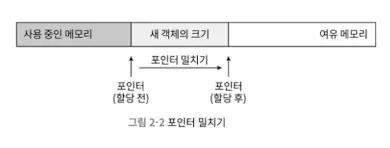

### 가용 공간 할당

- 객체에 필요한 메모리 크기: 클래스를 로딩하고 나면 완벽하게 알 수 있음
- 객체용 메모리 공간 할당
    - 특정 크기의 메모리를 힙에서 잘라 주는 일
- **자바 힙이 완전 규칙/이상적일 경우 -** 포인터 밀치기(bump the point-cr)
    - 사용 중인 메모리는 모두 한쪽에, 여유 메모리는 반대편에 자리
    - 포인터가 두 영역의 경계인 가운데 지점
    - 이 상태에서 메모리를 할당하면 → 포인터를 여유 공간 쪽으로, 정확히 객체 크기만큼 이동시키게 됨
- **자바 힙이 규칙적이지 않을 경우 -** 여유 목록(free list)
    - 사용 중인 메모리와 여유 메모리가 뒤섞여 있어서 포인터를 밀쳐 내기가 그리 간단하지 않음
    - 가상 머신은 가용 메모리 블록들을 목록으로 따로 관리
    - 객체 인스턴스를 담기에 충분한 공간을 찾아 할 당한 후 목록을 갱신

- **자바 힙의 규칙성 여부**: GC가 컴팩트(compact: 모으기)를 할 수 있느냐
    - compact 가능: 포인터 밀치기 -  단순하고 효율적, 시리얼과 파뉴(Pariew)
    - sweep 알고리즘: 여유 목록

### 객체 생성 시의 스레드 경합

- 멀티스레딩 환경에서는 여유 메모리의 시작 포인 터 위치를 수정하는 단순한 일도 스레드 안전하지 않음
- ⇒ 여러 스레드가 동시에 객체를 생성하려고 할 때 문제가 생길 수 있음

- **해법 1: 메모리 할당 동기화**
    - 비교 및 교환(CAS)과 실패 시 재시도 방식의 가상 머신
- **해법 2: 스레드마다 다른 메모리 공간을 할당**
    - **스레드 로컬 할당 버퍼(TLAB)**: 스레드 각각이 자바 힙 내에 전용 메모리를 미리 할당받아 놓는 것
    - 각 스레드는 로컬 버퍼에서 메모리를 할당받아 사용
    - 버퍼가 부족해지면 그때 동기화를 해 새로운 버퍼를 할당받음
    - 가상 머신이 스레드 로컬 할당 버퍼를 사용할지는 -XX:+/-UseTLAB 매개 변수 로 설정

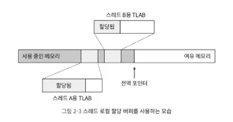

> 메모리 할당 → 0으로 초기화 → 객체에 필요한 설정 ⇒ 가상머신 관점의 신규 객체 생성 완료

- **0으로 초기화**
    - 메모리 할당이 끝났으면 가상 머신은 할당받은 공간을 0으로 초기화 (객체 헤더 제외)
    - 스레드 로컬 할당 버퍼를 사용한다면 초기화는 TLAB 할당 시 미리 수행
    - 자바 코드에서 객체의 인스턴스 필드를 초기화하지 않고도 사용할 수 있는 이유가 바로 이 단계 덕
    - 모든 필드가 자연스럽게 각 데이터 타입에 해당하는 0값을 담고 있게 되는 것

- **객체의 객체 헤더: 각 객체에 필요한 설정**
    - 어느 클래스의 인스턴스인지, 클래스의 메타 정보는 어떻게 찾는지, 이 객체의 해시 코드는 무엇인지(사실 해시 코드는 0bject::hashcode() 메서드가 처음 호출될 때 계산함), GC 세대 나이(age)는 얼마인지 등의 정보
    - 객체 헤더를 설정하는 방법은 가상 머신의 현재 구 동 모드(편향 락1] 활성화 여부 등)에 따라 달라질 수 있다.

- **사용 가능한 잔짜 객체 만들기 - 자바 프로그램 관점에서 객체 생성**
    - JVM 관점 생성 완료, 자바 프로그램 관점 대응 필요
    - 생성자(클래스의 init<>() 메서드)가 아직 실행되지 않았음
    - 모든 필드는 기본값인 0인 상태
    - 여러 자원과 상태 정보 역시 아직 개발자의 의도대로 구성되지 못함
    - ⇒ new 명령어에 이어서 <init>() 메서드까지 실행되어야 비로소 객체가 완성됨

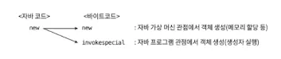

- **자바 컴파일러는 자바의 new 키워드를 발견**
    - 바이트코드 멍령어인 new와 invokespecial로 변환
    - **new**는 앞서 이야기한 메모리 할당 단계를 수행
    - **invokespecial**은 방금 이야기한 <init>() 메서드 호출을 담당
    - 하지만 자바 코드에서 new가 아닌 다른 방식으로 객체를 생성한 경우라면 invokespecial이 연이어 나오지 않을 수 있음

## 객체의 메모리 레이아웃

- **객체의 세 가지 부분**: 핫스팟 가상 머신
    - **객체 헤더**
    - **인스턴스 데이터**
    - **길이 맞추기용 정렬 패딩**

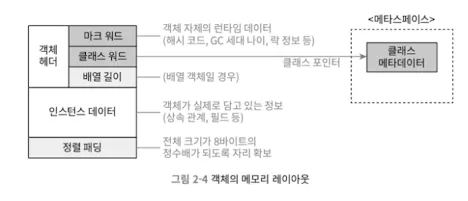

## 객체 헤더

- 2가지 유형 정보
- **마크 워드**
- **클래스 워드**

---

- **마크 워드 (mark word)**

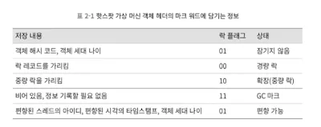

- **객체 자체의 런타임 데이터** : 해시 코드, GC 세대 나이, 락 상태 플래그, 스레드가 점유하고 있는 락들, 편향된 스레드의 아이디, 편향된 시각의 타임스탬프 등
- **크기**: 가상머신 크기와 같음 (압축 기능을 켜지 않으면)
- 객체는 아주 많은 런타임 데이터를 필요로 함 → 구조에 다 담을 수는 없음
- 더욱이 객체 헤더에는 객체 자체가 정의한 데이터와 관련 없는 정보까지 담아야 해서 한정된 메모리를 최대한 효율적으로 써야 함
- 마크 워드의 데이터 구조는 동적으로 의미가 달라짐: 작은 공간에 가능한 한 많은 정보 / 재활용을 위함

---

- **클래스 워드**
    - 객체의 클래스 관련 메타데이터를 가리키는 클래스 포인터 저장
    - **위치**: 마크워드 다음
    - 가상 머신은 저장된 포인터로 특정 객체가 어느 클래스의 인스턴스인지 런타임에 알 수 있음
    - 달리 말하면 객체의 메타데이터 정보를 반드시 객체 자체에서 찾아야 하는 건 아님

    ---

- **추가로 자바 배열**
    - 배열 길이도 객체 헤더에 저장
    - 위치: 클래스 워드 다음
    - 객체 헤더의 메타데이터로부터 자바 객체의 크기를 얻음
    - 하지만 객체 헤더에 저장되는 객체 타입은 배열에 담긴 '원소'의 타입
    - 따라서 배열 길이(원소 개수)까지 알아야 배열 객체가 차지하는 메모리 크기를 제대로 계산할 수 있음

## 인스턴스 데이터

- **객체가 실제로 담고 있는 정보** : 프로그램 코드에서 정의한 다양한 타입의 필드 관련 내용, 부모 클래스 유무, 부모 클래스에서 정의한 모든 필드
- **정보의 저장 순서**: 가상 머신의 할당 전략 매개 변수(-XX:FieldsAlloca tionstyle)와 자바 소스 코드에서 필드를 정의한 순서에 따라 달라짐
- **핫스팟 가상 머신의 할당 순서**
    - long, double, Int, short/char, byte/boolean, 일반 객체 포인터 순
    - 기본 할당 전략에서는 길이가 같은 필드들은 항상 같이 할당/저장됨
    - 필드 길이가 같다면 부모 클래스에서 정의된 필드가 자식 클래스의 필드보다 앞에 배치됨
    - 공간 절약: +XX:CompactFields 매개 변수를 true로 설정하면(기본값이 true임) 하위 클래스의 필드 중 길이가 짧은 것들은 상위 클래스의 변수 사이사이에 끼워 넣어짐

## 정렬 패딩

- 존재하지 않을 수도 있음
- **특별한 의미 없이 자리를 확보하는 역할**
- 핫스팟 가상머신은 **인스턴스 데이터 조건을 충족하지 못하는 경우**에만 패딩으로 채운다.
- 핫스팟 가상 머신의 자동 메모리 관리 시스템
    - 객체의 시작 주소는 반드시 8바이트의 정수배여야 함
    - = 모든 객체의 크기가 8바이트의 정수배여야 함
    - = 마지막 세 번째 부분은 정렬 패딩이어야 한다
    - 객체 헤더는 정확히 8바이트의 정수배가 되도록 잘 설계되어 있다(1배 또는 2배)

## 객체에 접근하기

- 대다수 객체는 다른 객체 여러 개를 조합해 만들어짐
- 자바 프로그램은 스택에 있는 참조 데이터를 통해 힙에 들어 있는 객체들에 접근해 객체 조작
- **자바 가상 머신 명세**
    - 참조 타입 - 객체를 가리키는 참조, 위치를 찾는 방법은 규정하지 않음
    - 따라서 객체에 접근하는 방식 역시 가상 머신에서 구현하기 나름
- **주로 핸들이나 다이렉트 포인터를 사용해 구현**

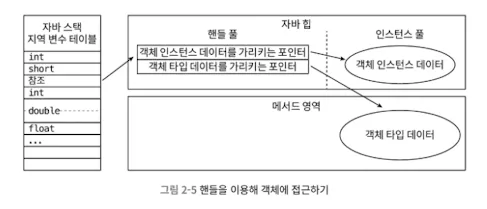

### 핸들 방식

- 자바 힙에 핸들 저장용 풀이 별도로 존재
- 참조에는 객체의 핸들 주소가 저장됨
- 핸들에는 다시 해당 객체의 인스턴스 데이터, 타입 데이터, 구조 등의 정확한 주소 정보
- **핸들 방식의 가장 큰 장점: 참조에 '안정적인' 핸들의 주소가 저장된다는 것**
    - GC 과정에서 객체 위치가 바뀔 때 핸들 내의 인스턴스 데이터 포인터만 변경하면 됨

---

### 다이렉트 포인터

- 자바 힙에 위치한 객체에서 인스턴스 데이터뿐 아니라 타입 데이터에 접근하는 길도 제공
- 스택의 참조에는 객체의 실제 주소가 바로 저장되어 있음
- **다이렉트 포인터 방식의 가장 큰 장점은 속도**
    - 핸들을 경유하는 오버헤드가 없음 → 타 객체에 접근할 일이 아주 많아서 실행 시간에 영향을 줄 수 있음
- 핫스팟은 주로 다이렉트 포인터 방식

# 2.4 실전: OutOfMemoryError 예외

- **프로그램 카운터 외 여러 런타임 영역에서 `OutOfMemoryError`가 날 수 있음**
- 이 장의 두 가지 실용적인 목적
    - 《자바 가상 머신 명세》에 정의된 각 런타임 영역에 저장되는 내용을 검중하는 것
    - 실제 메모리 오버플로가 일어나는 과정을 경험해 보는 것
- 매개 변수들을 그냥 지나쳐서는 절대 안 된다. (실행 결과에 영향)

## 자바 힙 오버플로

- 객체의 인스턴스를 저장하는 공간
- 자바 애플리케이션에서 OutOfMemoryError가 가장 많이 발생하는 영역
- java.lang.OutOfMemoryError 메시지 옆에 Java heap space 출력

- 코드 2-3: 자바 힙 메모리 오버플로 테스트

- **해결법**: 메모리 이미지 분석 도구로 힙 덤프 스냅숏을 분석
    - **오버플로를 일으킨 객체가 꼭 필요한 객체인가? → 메모리 누수? 오버플로?**
    - 필요없는 객체가 원인이라면 메모리 누수

### 메모리 누수라면

- **누수된 객체로부터 GC 루트까지의 참조 사슬을 살펴봄**
    - 누수된 객체까지 어떤 참조 경로가 존재하는지
    - 어느 GC 루트와 연결되어 있기에 가비지 컬렉터가 회수하지 못했는지

### 메모리 누수가 아니라면

- **가상 머신에 메모리를 더 많이 할당할 수 있는지**
    - JVM 힙 매개 변수 설정(-Xmx와 -Xms)과 컴퓨터의 가용 메모리 비교
- **프로그램이 런타임에 소비하는 메모리를 최소화**
    - 코드에서 수명 주기가 너무 길거나 상태를 너무 오래 유지하 는 객체는 없는지, 공간 낭비가 심한 데이터 구조를 쓰고 있지는 않은지

## 가상 머신 스택과 네이티브 메서드 스택 오버플로

- 가상 머신 스택과 네이티브 메서드 스택에서는 다음 두 경우 예외가 발생
1. **StackOverflowError**: 스레드가 요구하는 스택 깊이가 가상 머신이 허용하는 최대 깊이보다 크면
2. **OutOfMemoryError**: 가상 머신이 스택 메모리를 동적으로 확장하는 기능을 지원하나 가용 메모리가 부족해 스택을 더 확장할 수 없다면
- **핫스팟**
    - 스택 크기는 -Xss 매개 변수로만 변경 (VM스택과 네이티브 메서드 스택을 구분하지 않음)
    - 확장을 지원하지 않음
    - 스택 용량이 부족하여 새로운 스택 프레임을 담을 수 없을 때만 **StackOverflowError** 발생

1. **-Xss 매개 변수로 메모리 용량 줄이기**

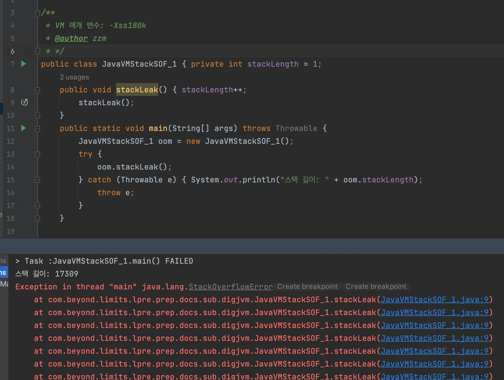

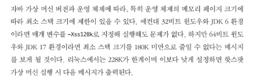

2. **지역 변수를 많이 선언해서 메서드 프레임 지역변수 테이블을 키우기**
    - 예외 발생 시 출력된 스택 깊이는 의도대로 축소되어 있음

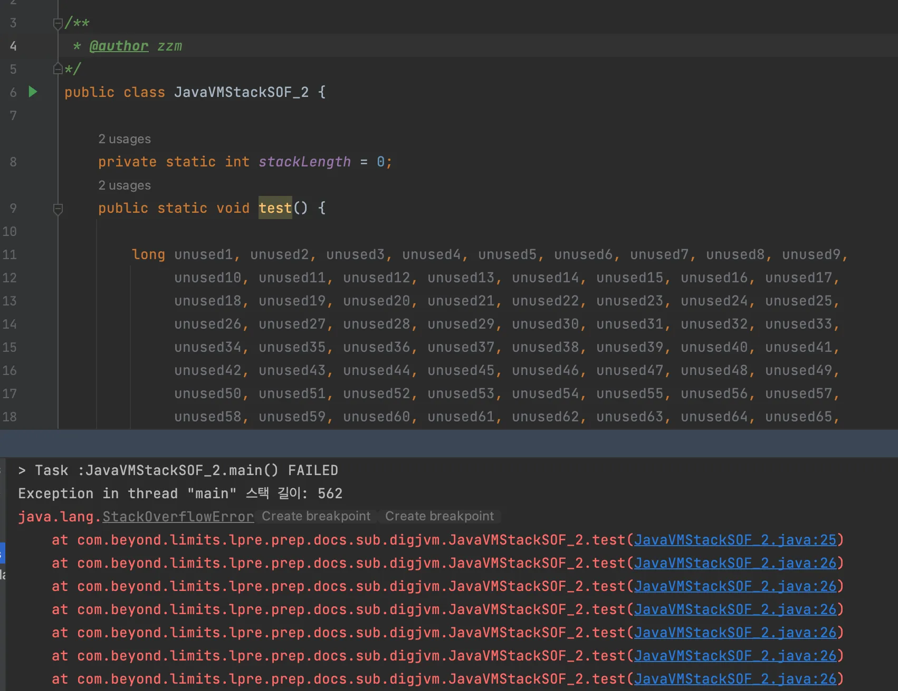

- 출력 결과를 보면 **스택 프레임이 너무 커서인지, 아니면 가상 머신 스택 용량이 부족해서인지** 알 수 있음
- 가상 머신이 스택 크기를 동적으로 확장할 수 있다면 `java. lang.OutOfMemoryError`를 일으킬 수 있기 때문

---

- 단일 스레드로 제한하지 않고, **스레드를 계속 만들어 내면** 핫스팟에서도 메모리 오버플로를 일으킬 수 있음
- **멀티 스레드의 오버플로: 운영체제 자체의 메모리 상태가 더 중요**
    - 스택 공간이 충분한지와는 아무런 관련이 없음
    - 심지어 이 경우에는 **스레드별 스택을 크게 잡을수록 메모리 오버플로를 쉽게 일으킬 수 있음**
- **이유: 운영 체제가 각 프로세스에 할당하는 메모리 크기가 제한적이기 때문**
    - 예컨대 32비트 윈도우에서 프로세스 하나가 쓸 수 있는 최대 메모리는 2GB
    - **핫스팟 가상 머신은 자바 힙과 메서드 영역의 최댓 값을 매개 변수로 설정할 수 있음**
- **남은 메모리 = 운영체제의 한계 - 힙의 최대 크기 - 메서드 영역의 최대 크기**
    - 운영 체제의 한계인 2GB에서 힙의 최대 크기를 빼고, 다시 메서드 영역의 최대 크기를 뺀 값
    - 프로그램 카운터가 차지하는 메모리는 아주 작으니 무시
- **실제 스레드 사용 가능 메모리 = 남은 메모리 - (Direct Memory + JVM Process Memory)**
    - 다이렉트 메모리와 자바 가상 머신 프로세스가 자체적으로 소비하는 메모리를 제외한
    - 나머지가 가상 머신 스택과 네이티브 메서드 스택에 할당됨
- **`각 스레드에 스택 메모리를 많이 할당하면 생성할 수 있는 스레드 수가 적어짐`**
- 즉, 새로운 스레드를 생성하려 할 때 메모리 고갈될 가능성이 커지는 것

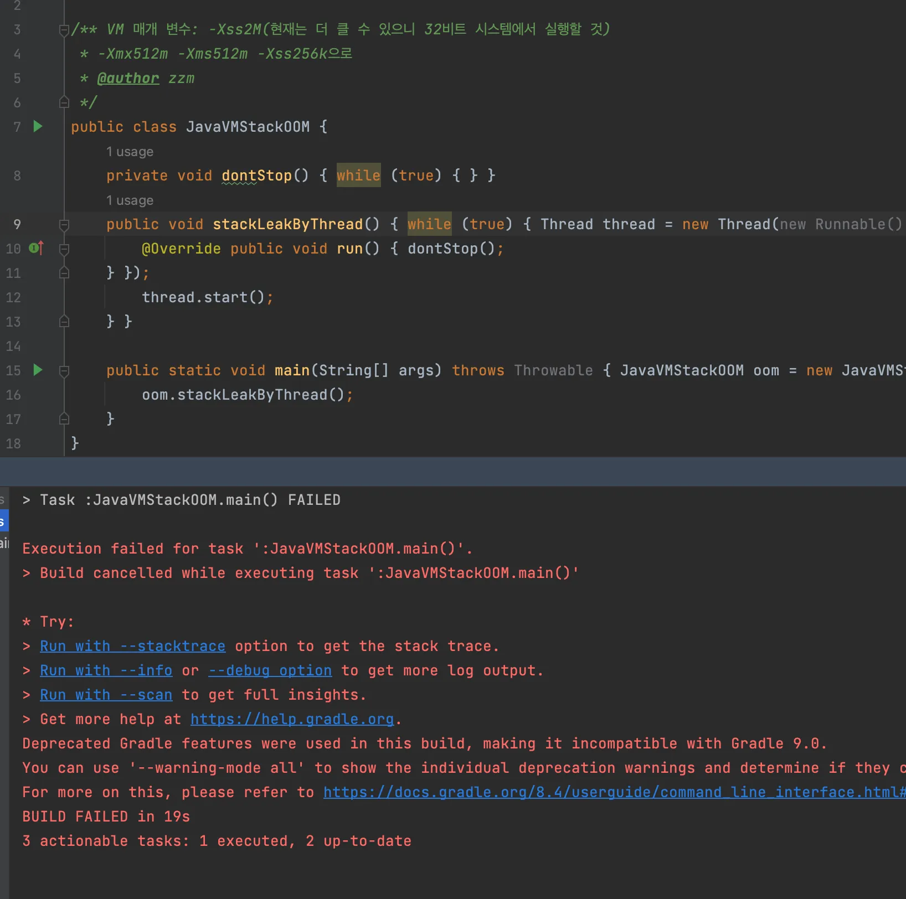

- 매개변수 바꿔서 하다가 RunCat 고양이가 미친듯이 달리길래 무서워서 끔..;

- `StackoverflowError`: 예외를 일으킨 스택 정보가 분석용으로 제공 - 문제 위치를 찾기가 상대적으로 쉬움
- 핫스팟 가상 머신을 기본 매개 변수로 실행 했다면
    - 대부분의 경우 스택 깊이가 1000~2000 수준으로 커져도 문제가 없음
    - 스택에 추가할 프레임 크기는 메서드마다 다르므로 이 부분은 파악 필요
- 꼬리 재귀로 최적화하지 못하는 재귀 호출도 포함하여 일반적인 메서드 호출에서는 이 정도 깊이도 충분
- **최대 힙 크기와 스택 용량을 줄이는 것이 OOM을 막는 유일한 방법인 상황**
    - 너무 많은 스레드를 만들어 메모리 오버플로가 일어나는 경우
      && 프로그램에서 사용하는 스레드 수도 줄일 수 없고 64비트 가상 머신도 사용할 수 없는 상황
    - 이런 조건에서 스레드를 더 많이 만들 수 있는 방법은 최대 힙 크기과 스택 용량 줄이기
    - 메모리 오버플로를 해결하기 위해 '메모리 용량을 줄인다'는 아이디어
      → **적은 양을 많은 바구니에 담을 것인가**, 적은 바구니에 많은 양을 담을 것인가

---

## 메서드 영역과 런타임 상수 풀 오버플로

> **메서드 영역:** 영구 세대인가? 메타스페이스 인가?
>

- 런타임 상수 풀은 메서드 영역
- 따라서 두 영역의 오버플로 테스트는 함께 수행할 수 있음
- 핫스팟은 JDK 7부터 영구 세대를 점진적으로 없애기 시작하여 JDK 8에 와서 메타스페이스로 완전히 대체
- `String::intern()`: 네이티브 메서드
    - 문자열 상수 풀에 똑같은 문자열이 이미 존재한다면 풀에 있던 기존 문자열의 참조를 반환
    - 같은 문자열이 없다면 현재 String 객체에 담긴 문자열이 상수 풀에 추가 / String의 참조가 반환
    - JDK 6까지 핫스팟은 상수 풀은 영구 세대에 할당됨

### 영구 세대의 크기 조절 매개변수를 Argument로 주면?

- **영구 세대의 크기 조절 매개 변수**: `XX:PermSize`와 `-X:MaxPeresize`
    - 상수 풀 용량에도 간접적으로 영향을 줌
- **JDK 6의 핫스팟 : 메서드 영역은 영구 세대**
    - 런타임 상수 풀이 오버플로 ⇒ **OutOfMemoryError: PermGen space**
    - 런타임 상수 풀이 정말로 메서드 영역의 한 부분이라는 의미
- **JDK 7 이상에서 실행 : 메서드 영역은 자바 힙**
    - 아무런 예외도 던지지 않고 **무한 루프**
    - 영구 세대에 저장했던 문자열 상수 풀을 JDK 7부터 자바 힙으로 옮겼기 때문
    - 메서드 영역 제한의 의미가 없어진 것

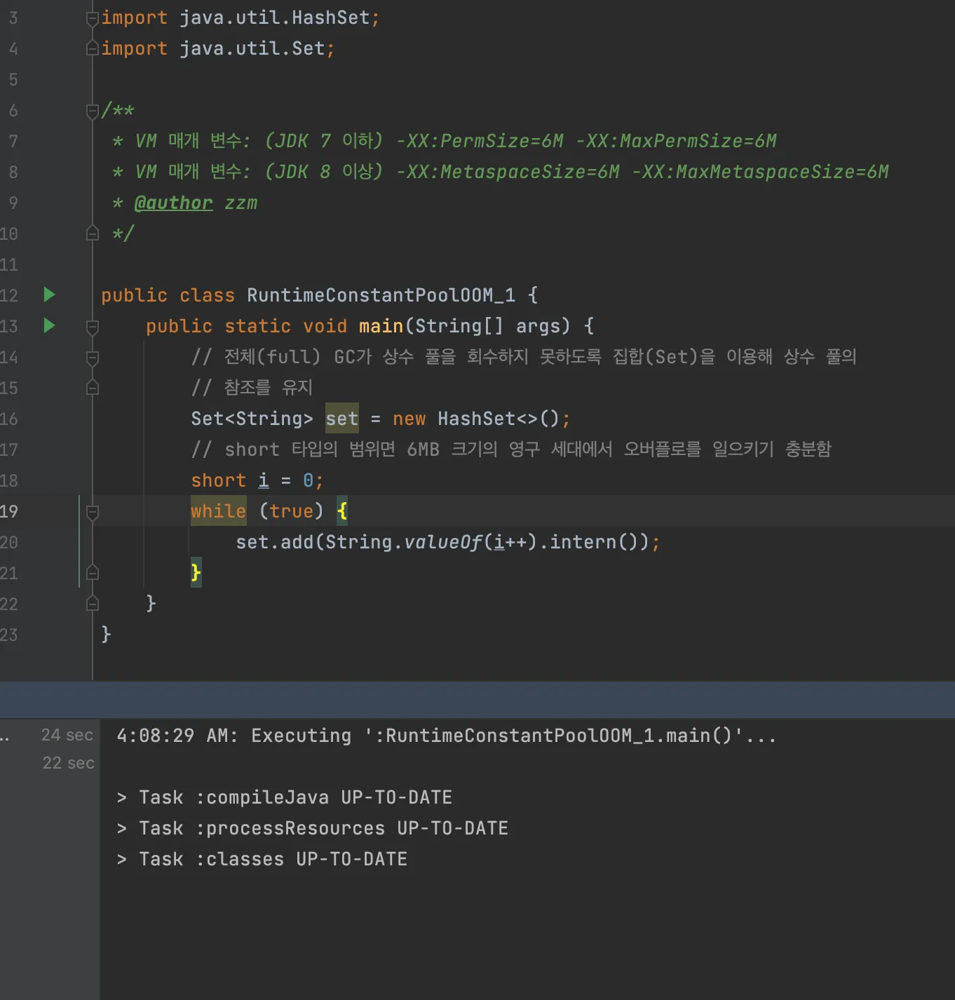

⇒ JDK 6으로 실행해 보고자 했으나… OOM이 죽어도 안 나서 일단 패스.

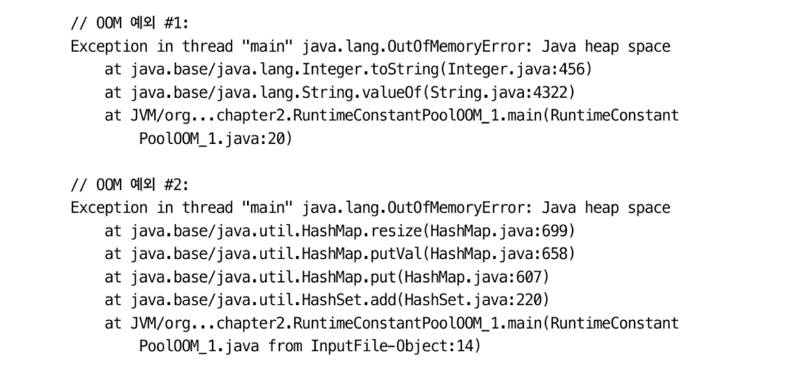

- 최대 힙 크기 6MB: 매개 변수를 -Xmx6M으로 변경
    - OOM 예외 1: 오버플로가 객체 할당 시 일어나면 객체 생성 자체가 안 됨
    - OOM 예외 2: 아닐 경우 HashMap 조정 시 일어나므로 HashMap resize 에러

### 문자열 상수 풀 참조 값이 어디에 있는가?

- `str1.intern() == str1`
    - JDK 6: false, 영구 세대의 문자열 풀에 복제한 다음 문자열 인스턴스 참조값 반환 (신규 객체)
    - JDK 7: true, StringBullder로 생성한 문자열 객체의 인스턴스(str1)는 자바 힙에 존재 / 풀에 있는 인스턴스 참조로만 바꿔주면 됨 (기존 객체 탐색 후 반환)

### 메서드 영역의 다른 부분에 들어가는 내용도 살펴보자.

- 메서드 영역의 주 역할: 타입 관련 정보 저장
- 클래스 이름, 접근 제한자, 상수 풀, 필드 설명, 메서드 설명 등

- **CGLib**
    - 런타임에 바이트코드를 직접 조작하여 다량의 클래스를 동적으로 생성
- 테스트를 위해서는 런타임에 메서드 영역이 가득 찰 때까지 계속해서 클래스를 생성해야 함
- 바이트 코드 조작 기술: 우리 주변의 애플리케이선에서도 실제로 목격할 수 있는 코드, 스프링과 하이버네이트처럼
- 더 큰 메서드 영역이 필요: 더 많은 클래스가 강화될수록 동적으로 생성된 새로운 클래스 들을 모두 메모리로 로드하기 위함
- 클래스를 동적으로 생성하기 위해 자바 SE API를 바로 쓸 수도 있지만, 이번 테스트를 수행하기에는 더 번거로움 (리플렉션 중 GeneratedConstructorAccessor와 동적 프락시처럼)

- 자바 가상 머신에서 구동되는 많은 동적 언어(그루비 등)가 언어의 동적 특성을 지원하기 위해 계속해서 새로운 클래스를 만들어 냄
- 동적 언어가 유행하면서 코드 2-9와 비슷한 오버플로 시나리오도 더 자주 생길 수 있음

- **JDK 7 실행 결과**: java.lang.OutOfMemoryError thrown from the UncaughtExceptionHandler in thread "main"
- **JDK 15 실행 결과**: java.lang.OutOfMemoryError: Metaspace at java.base/java.lang.Class.forNane@(Native Method) at java.base/java. lang.Class. forNane(Class. java:468)
- JDK 16부터는 보안 강화 차원에서 CGLib이 사용하던 리플렉션 API를 사용할 수 없음

## 메서드 영역의 오버플로

- 흔히 발생하는 메모리 오버플로 예외
- 가비지 컬렉터가 클래스 하나를 회수해 가기 위한 조건은 생각보다 까다로움
- **애플리케이선에서 빈번히 실행되는 코드가 동적 클래스를 많이 생성**한다면 이 클래스들을 **회수하는 시점에 특별히 신경 써야 함**
    - 동적으로 JSP 파일을 생성하는 웹 사이트 또는 애플리케이션(JSP가 실행되려면 먼저 자바 클래스로 컴파일해야 함)
    - OSGi 애플리케이션(같은 플래스 파일이라도 다른 로더가 읽어 들였다면 다른 클래스로 간주함)

- **JDK 8**
    - 영구 세대가 역사의 뒤안길로 완전히 사라짐
    - 대체제로 메타스페이스를 이용
    - 기본 설정 + 일반적인 동적 생성 시나리오로는 메서드 영역에서 오버플로를 일으키기 어려움

- **메타스페이스 보호용 매개변수**
    - -XX:Maxmetaspacesize: 메타스페이스의 최대 크기를 설정
        - 기본값은 1
        - 제한 없음 또는 '네이티브 메모리 크기가 허용하는 만큼'이란 뜻
    - -XX:Metaspacesize: 메타스페이스의 초기 크기를 바이트 단위로 지정
        - 이 크기가 가득 차면 가비지 컬렉터가 클래스 언로딩을 시도한 다음 크기를 조정한 다. 클래스 언로딩으로 공간이 넉넉하게 화보됐다면 이 값을 줄이고, 많이 화보 하지 못했다면 적절한 값으로 중가시킨다.
        - 단, -XK:MaxMetaspacesize로 최댓값 을 설정했다면 그 값을 초과할 수 없다.
    - -XX:MinMetaspaceFreeRatio: 가비지 컬렉션 후 가장 작은 메타스페이스 여유 공 간의 비율(%)을 정함
        - 이 값을 조절해 메타스페이스 공간이 부족해 발생하는 가비지 컬렉션 빈도를 줄일 수 있음
        - 비슷하게 -X:MaxNetaspaceFreeRatio로는 가장 큰 메타스페이스의 남은 공간의 비율을 설정한다.
    - 파괴적인 동작을 수행하는 걸 방지하기 위함

## 네이티브 다이렉트 메모리 오버플로

- **다이렉트 메모리의 용량**
    - 기본적으로 -Xmx로 설정한 자바 힙의 최댓값
    - -XX:MaxDirectMemorysize 매개 변수로 설정
- **네이티브 다이렉트 메모리 오버플로 발생시키기**
    - NIO의 DirectByteBuffer 클래스를 건너뛰고 리플렉션을 이용해 Unsafe 인스턴스를 직접 얻어 메모리를 할당
- **Unsafe**: 할당할 수 없는 크기를 계산해 오버플로를 수동으로 일으킬 수 있음
    - 메모리 할당 메서드: `Unsafe::allocateMemory()`
- **다이렉트 메모리에서 발생한 메모리 오버플로의 두드러진 특징**
    - 힙 덤프 파일에서는 이상한 점을 찾을 수 없다
    - **다이렉트 메모리에서 원인을 찾아야 함**
        - 메모리 오버플로로 생성된 덤프 파일이 매우 작다면 && 프로그램에서 DirectMemory를 직접 또는 간접적으로(보동 NIO를 통해) 사용했다면
- **왜 Unsafe 인스턴스에서 내는가?**
    - Unsafe는 원래 오직 가상 머신과 표준 클래스 라이브러리에서만 사용하도록 설계된 클래스
    - Unsafe 클래스의 getUnsafe() 메서드는 부트 클래스 로더만이 인스턴스를 반환하도록 해 둠
    - JDK 10에 와서야 VarHandle을 통해 Unsafe의 기능 일부를 외부에서도 사용할 수 있도록 공개
    - DirectByteBuffer를 통해 메모리를 할당해도 오버플로될 수는 있지만, 이 경우는 운영 체제 단에서 메모리를 할당하느라 나는 예외가 아님
- **DirectByteBuffer: Java NIO(New I/O)에서 사용되는 특별한 종류의 ByteBuffer**
    - 일반 ByteBuffer: JVM의 힙 메모리에 저장
    - DirectByteBuffer: OS의 native 메모리에 직접 할당 (JVM 힙 외부)
    - 정상 경로: 애플리케이션 → DirectByteBuffer → Unsafe → Native 메모리
    - 현재 강제 경로: 애플리케이션 → 리플렉션 → Unsafe → Native 메모리 (DirectByteBuffer 우회)

# 2.5 마치며

> 자바가 가비지 컬렉션을 제공하더라도 메모리 오버플로는 항상 우리 주변을 서성이고 있다.

- **이번 장**
    - **가상 머신이 메모리를 어떻게 나눠 관리하는지**
    - **각 영역에서 어떤 코드와 동작이 메모리 오버플로를 일으키는지**
- **다음 장: GC는 메모리 오버플로를 피하기 위해 어떤 노력을 하고 있는가?**