# 6.2 플랫폼 독립을 향한 초석

- JVM ≠ 자바 프로그램 only
    - 자바 기술은 초기부터 가상 머신에서 다른 언어를 실행할 가능성을 염두에 두었음
    - 자바 기술 명세서도 <자바 언어 명세>와 <자바 가상 머신 명세>가 구분되어 있음
    - 1997년 최초의 <자바 가상 머신 명세>에서는, ‘미래에는 다른 언어를 더 잘 지원하도록 자바 가상 머신을 확장할 것’이라고 명시해둠
        - 2018년 GraalVM을 통해서 이를 달성
- 언어 독립성
    - 언어 독립성의 핵심은 가상 머신과 바이트코드(*.class) 저장 형식
    - JVM은 프로그래밍 언어에 종속되지 않고, ‘클래스 파일’이라는 특정한 바이너리 파일 형식에만 의존함
    - <자바 가상 머신 명세>는 클래스 파일의 구조를 정의하고 있음
        - 클래스 파일의 원래 소스 코드가 어떤 언어였는지는 무관함
        - https://docs.oracle.com/javase/specs/jvms/se21/html/index.html

# 6.3 클래스 파일의 구조

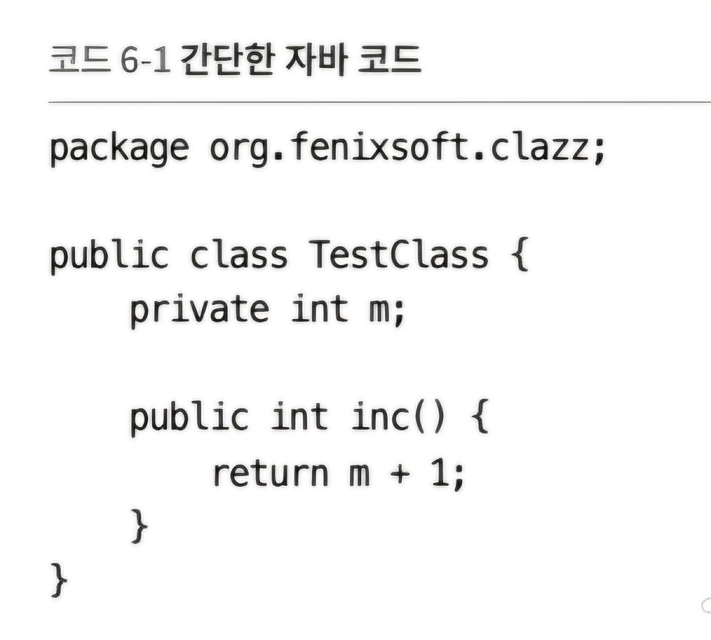

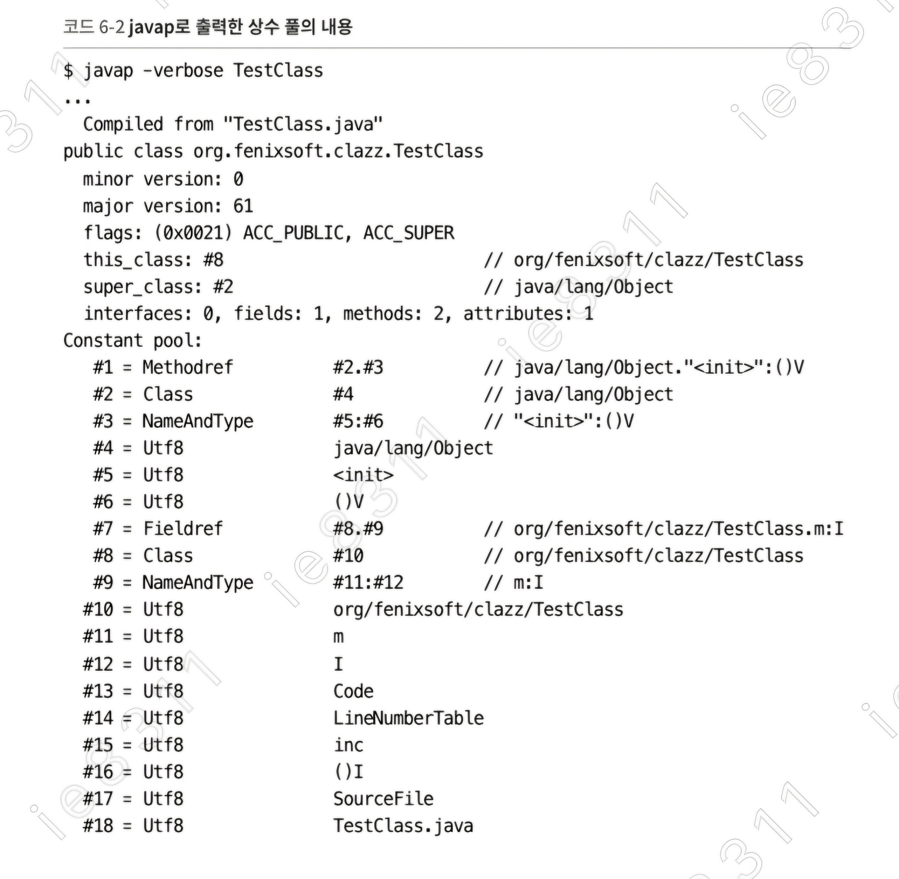

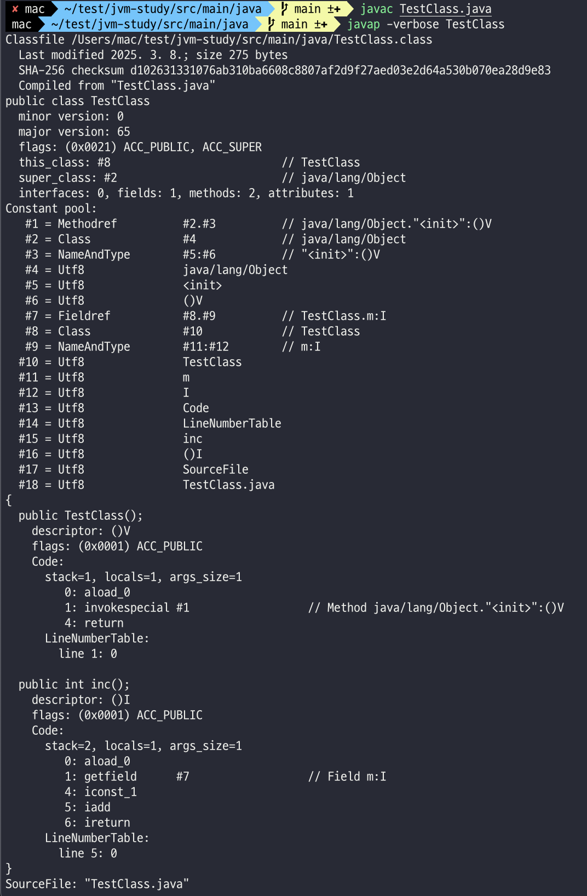

- 클래스 파일 구조가 안정적으로 잘 정의되어 있기 때문에, 자바는 하위 호환성이 매우 잘 유지됨
- 이 장에서 설명하는 클래스 파일 구조의 대부분은, <자바 가상 머신 명세> 1판의 내용 그대로임
- 모든 클래스 파일은 하나의 클래스 or 인터페이스를 정의함
    - 예외 : package-info.class (패키지 정보 기술), module-info.class (모듈 정보 기술)
- 클래스 파일
    - 바이트를 단위로 하는 바이너리 스트림 집합체
    - 각 데이터 항목이 정해진 순서대로, 구분 기호 없이 컴팩트하게 나열되어 있음 (→ 낭비되는 공간 없이 꼭 필요한 데이터로 채워짐)
    - 1바이트가 넘는 데이터는 바이트 단위로 분할되어, 빅 엔디언 방식(MSB를 먼저 저장)으로 표현됨
- 의사 구조체(pseudo structure)
    - 클래스 파일에는 C언어의 구조체와 유사한 의사 구조체를 사용함
    - 의사 구조체에서 사용되는 2가지 데이터 타입
        - unsigned number (`u1`, `u2`, `u4`, `u8`)
        - 테이블
            - unsigned number와 다른 테이블들의 조합으로 구성
            - 이름은 관습적으로 _info 접미사를 붙임
- 클래스 파일 구조
    - 
    
    
    
    - 같은 타입 데이터 여러개(가변)를 표현할 때, 개수를 알려주는 타입을 바로 앞에 사용함
        - *_count (e.g., `constant_pool_count`)
        - {개수 + 개수만큼의 데이터 타입} 형태를 ‘컬렉션’이라고 함
    - 구분자를 사용하지 않기 때문에, 데이터가 저장되는 바이트 순서(byte ordering), 각 바이트의 의미, 길이, 순서가 엄격하게 제한되며 변경할 수 없음

## 6.3.1 매직 넘버와 클래스 파일의 버전

- 매직 넘버
    - 모든 클래스 파일의 첫 4바이트는 매직 넘버임
    - 가상 머신이 허용하는 클래스 파일인지 여부를 빠르게 확인하기 위함
    - GIF, JPEG 같은 이미지 파일에도 파일 헤더에 매직 넘버를 사용함
        - 파일 확장자는 사용자가 마음대로 변경할 수 있기 때문에, 매직 넘버가 좀 더 안정적으로 파일 형식을 식별할 수 있음
    - `0xCAFEBABE` 를 사용함
        - 개발자가 자주 가던 카페의 인기 바리스타가 눈에 띄어서 결정한 이름 😄
- 버전 번호
    - 5~6 바이트 : minor version
    - 7~8 바이트 : major version
    - 실제 버전 할당
        - JDK 1.0 은 45.0
        - 메이저 버전은 1씩 증가
        - JDK 1.2는 46.0
        - JDK 8은 52.0
        - JDK 17은 61.0
            - `00 00 00 3D`
                - `00 00` : 0x0000 = 마이너 버전 0
                - `00 3D` : 0x003D = 메이저 버전 61 = JDK 17
        - JDK 1.2부터는 마이너 버전을 사용하지 않아서, 모두 값이 0으로 고정되어 있음
            - 단, JDK 12부터 새 기능을 공개 베타 버전으로 출시할 때, 마이너 버전을 활용함
    - 상위 버전 JDK는 하위 버전 클래스 파일을 인식할 수 있으나, 하위 버전 JDK는 상우 ㅣ버전 클래스 파일을 실행할 수 없음
        - <자바 가상 머신 명세>에서, “파일 형식이 변경되지 않았더라도 상위 버전의 클래스 파일을 실행하면 안 된다”라고 규정하고 있기 때문
        - (왜일까? 혹시 모를 사이드 이펙트를 방지하기 위해서?)

## 6.3.2 상수 풀

- (🤔 당연한 거지만 저는 놓치고 있었던 사실) 상수 풀은 클래스 파일마다 별도로 존재한다.
- `constant_pool_count`
    - 상수 풀에 들어있는 상수의 개수를 지정
    - `constant_pool_count` - 1 = 실제 상수 개수
        - 0은 ‘상수 풀을 참조하지 않음’을 의미함
    - constant pool 안의 각각의 항목을 entry라고 부름
        - https://docs.oracle.com/javase/specs/jvms/se21/html/jvms-4.html#jvms-4.4
- 상수 풀의 항목 타입 (constant pool entry types)
    - 각 상수 타입은 의사 구조체이고, 2~3개의 필드로 구성되어 있다. 첫번째 필드는 항상 `u1` tag이며, 상수의 타입을 의미한다.
    - 예컨대, `CONSTNAT_String_info` 의 경우 tag = 8이고, 2번째 필드 index는 문자열 리터럴을 가리키는 인덱스(= constant pool의 인덱스)를 의미한다.
    
    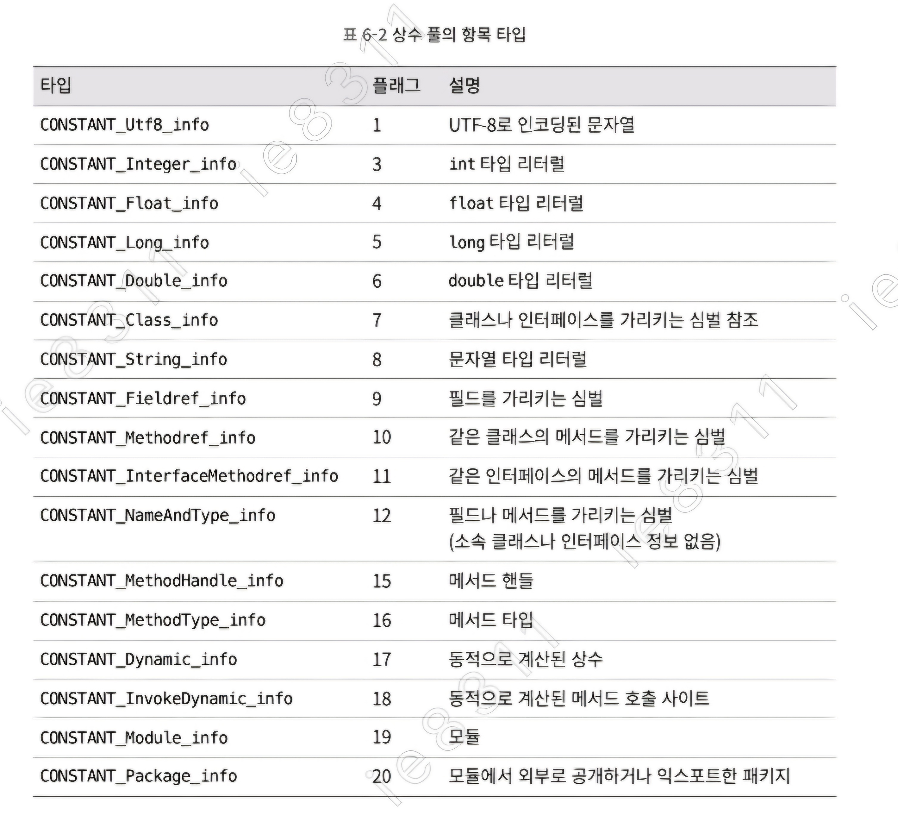
    

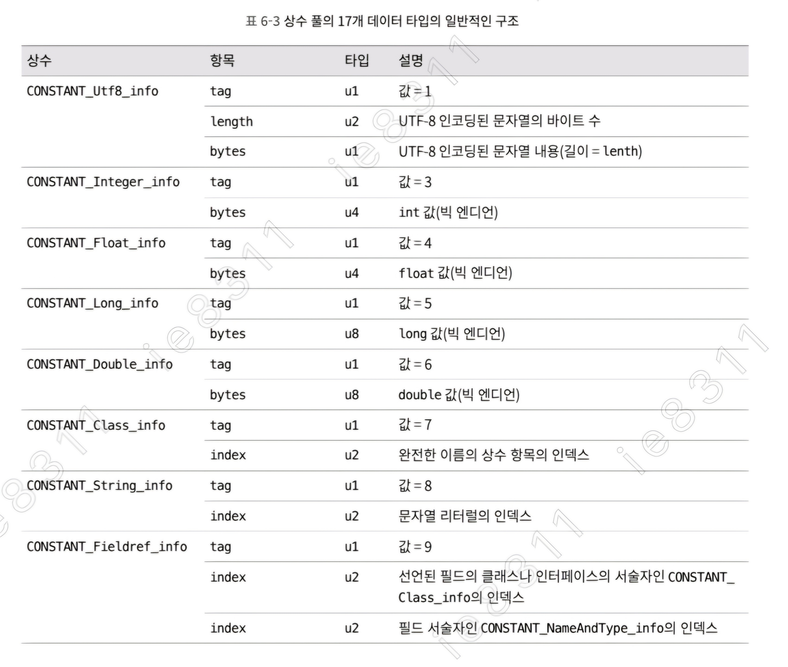

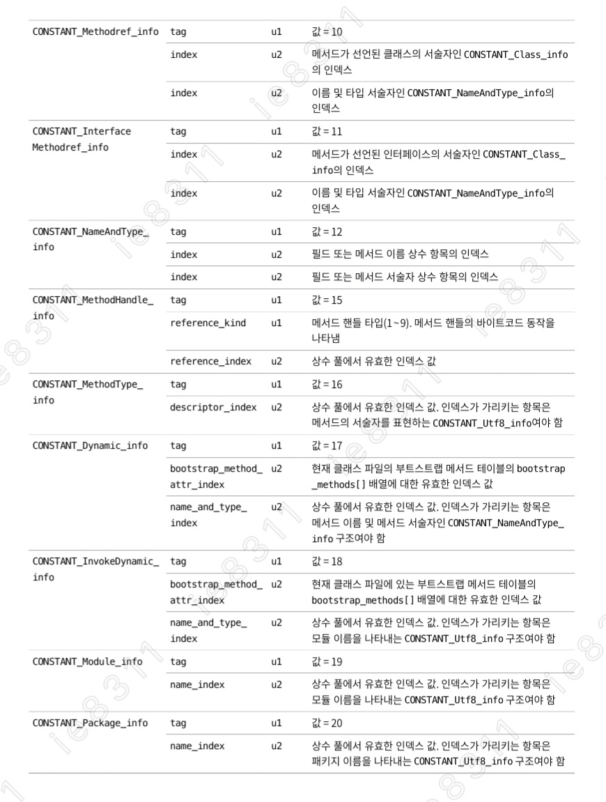

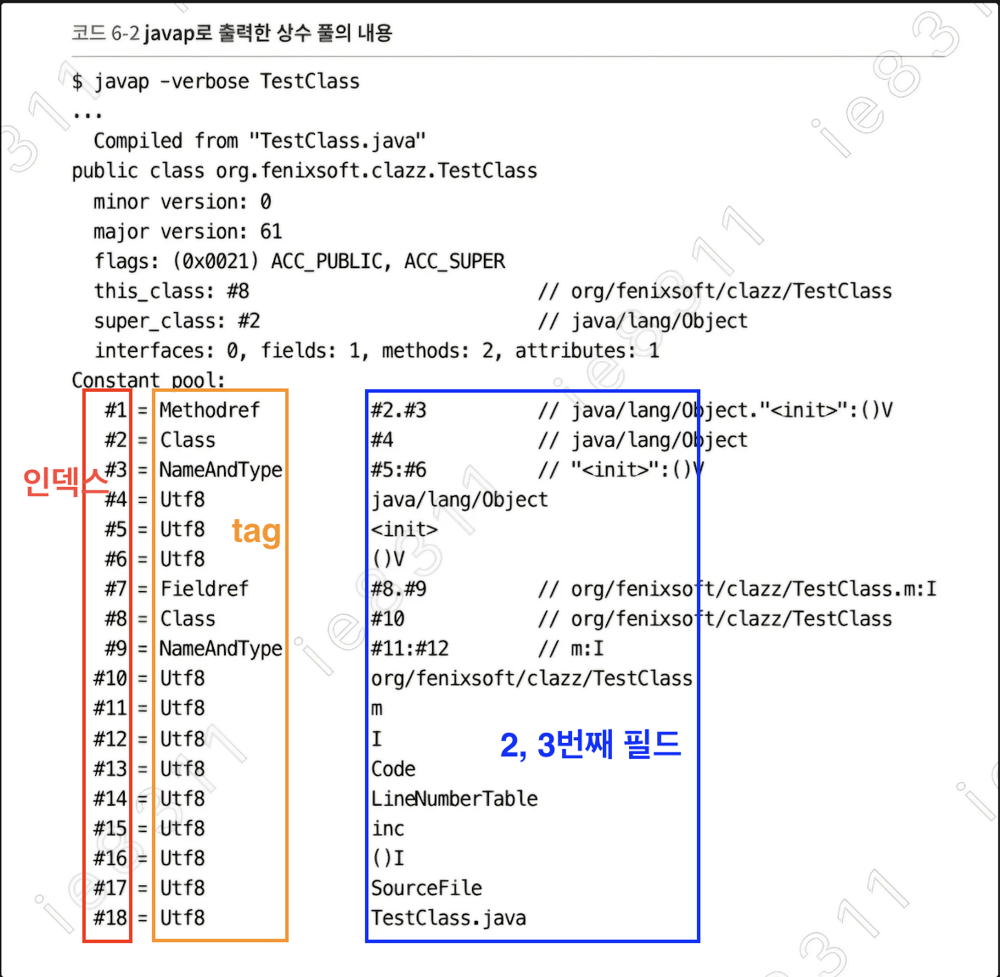

- 상수 풀에 담기는 상수 유형 2가지
    - 리터럴
        - 자바 언어의 상수와 비슷한 개념
        - 종류
            - `CONSTANT_Utf8_info`
                - 클래스 이름, 메서드 이름, 필드 이름
                - 메서드와 필드의 디스크립터
                - 컴파일 타임에 결정되는 문자열
                    - StringBuilder의 내용은 여기에 저장되지 않음. StringBuilder의 toString()을 호출하여 생성된 String 역시 여기에 저장되지 않음 (런타임에 힙의 String Pool에 저장됨??)
                    - (1) String s = “hello”;
                    - (2) String s = new String(”hello”);
                    - 상수 풀 안의 문자열 사용 방식
                        - 컴파일 : `CONSTANT_Utf8_info` 와 `CONSTANT_String_info` 를 생성
                        - 클래스 로딩 : `CONSTANT_String_info` 를 String 객체로 변환하여, 자바 힙 내부의 String Pool에 추가
                        - 런타임 : String Pool에서 문자열을 사용
                - 소스 파일 이름
                    
                    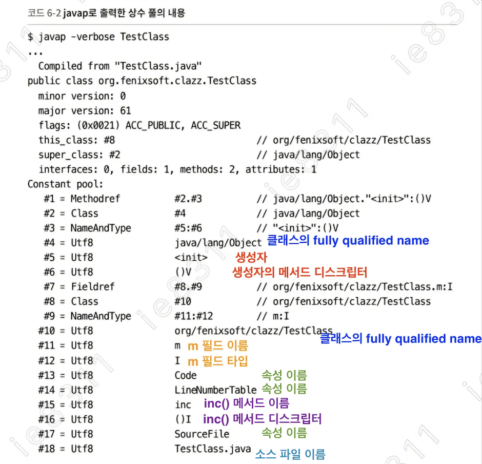
                    
            - `CONSTANT_Integer_info`
            - `CONSTANT_Float_info`
            - `CONSTANT_Long_info`
            - `CONSTANT_Double_info`
    - 심벌 참조 (symbolic reference)
        - 컴파일 타임에 정확한 메모리 위치를 알 수 없는 녀석들에 대한 참조
        - 클래스가 로드되고 링크될 때, 실제 메모리 주소로 해석됨
        - 종류
            - 모듈에서 export/import 하는 패키지
            - 클래스/인터페이스의 이름 (fully qualified name, binary name)
            - 필드 이름과 서술자 (descriptor)
            - 메서드 이름과 서술자
            - 메서드 핸들과 메서드 타입 (method handle, method type, invoke dynamic)
            - 동적으로 계산되는 호출 사이트, 동적으로 계산되는 상수 (dynamically-computed call site, dynamically-computed contant)
        - 사용 방식
            - 자바 코드를 javac로 컴파일 할 때는, C/C++과 달리 링크 단계가 없음
            - 자바에서 링크는 JVM이 클래스 파일을 로드할 때 동적으로 이루어짐
            - 즉, 필드/메서드가 메모리에서 어떤 구조로 표현되는지에 대한 정보는 클래스 파일에 저장되지 않음
            - 따라서 JVM이 필드/메서드의 심벌 참조를 런타임에 변환하지 않으면, 각 항목의 실제 메모리 주소를 알 수 없음
            - JVM은 클래스 파일을 로드할 때, 상수 풀에서 해당 심벌 참조들을 가져온다. 클래스가 생성되거나 구동할 때 해석해서 실제 메모리 주소로 변환한다.

## 6.3.3 접근 플래그 (Access Flags)

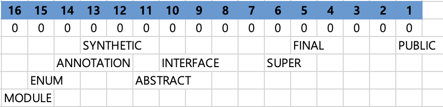

- 현재 클래스(or 인터페이스)의 접근 정보
    - 대상이 클래스인지 인터페이스인지, public인지, abstact인지, final인지 등
- 코드 6-1 TestClass 예시

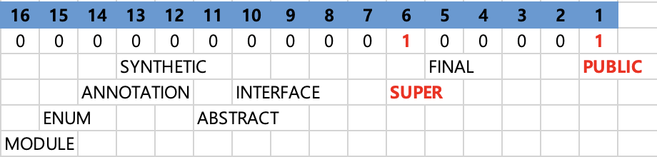

## 6.3.4 클래스 인덱스, 부모 클래스 인덱스, 인터페이스 인덱스

- 클래스 인덱스
    - `this_class`
    - 이 값도 일종의 인덱스이다. 이 인덱스가 가리키는 엔트리는 `CONSTANT_Class_info` 타입이다.
- 부모 클래스 인덱스
    - `super_class`
    - 이 값도 역시 일종의 인덱스이고, 이 인덱스가 가리키는 엔트리는 `CONSTANT_Class_info` 타입이다.
    - 자바는 다중 상속을 허용하지 않으므로, 부모 클래스는 하나뿐이다.
        - 단, `java.lang.Object`는 부모 클래스가 없으므로, 이 값이 0이다.
        - 그 외의 경우는, 상수 풀에서 `CONSTANT_Class_info`를 가리키는 유효한 인덱스여야 한다.
- 인터페이스 인덱스
    - `interfaces`
    - 첫 항목은 `interfaces_count` , 즉 인덱스 테이블의 크기

## 6.3.5 필드 테이블

- `field_info`
- 인터페이스 / 클래스 안에 선언된 변수들을 설명

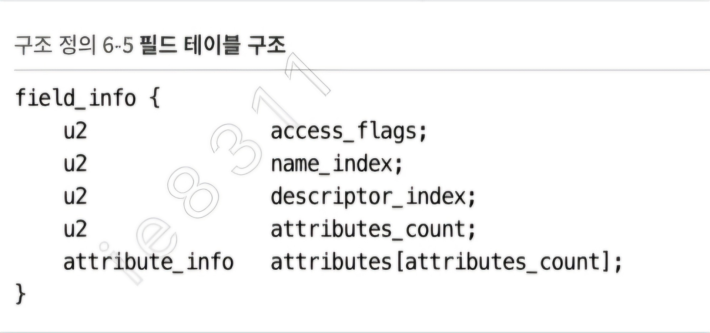

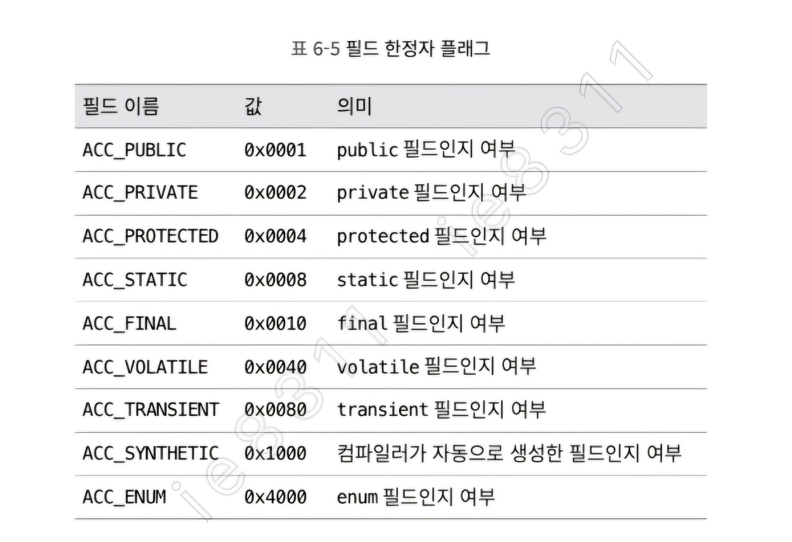

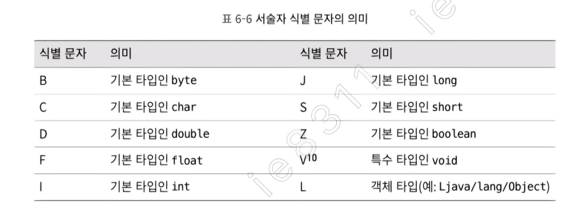

- 이름
    - 단순한 이름
        - 예 : m, inc
    - 완전한 이름
        - 예 : java/lang/Object, org/fenixsoft/clazz/TestClass
- 필드 서술자 (Field Descriptors) 및 메서드 서술자 (Method Descriptors)
    - 객체 타입
        - 책에는 `L ClassName` 이라고 써있지만, 오라클 JVM 명세나 챗GPT 모두 마지막에 세미콜론을 명시하라고 함 (`L ClassName ;`)
        - https://docs.oracle.com/javase/specs/jvms/se21/html/jvms-4.html#jvms-4.3.2
    - 예시
        - `int[]` → `[I`
        - `java.lang.String[][]` → `[[Ljava/lang/String;`
        - `void inc()` → `()V`
        - `java.lang.String.toString()` → `()Ljava/lang/String;`
        - `double add(double a, double b)` → `(DD)D`
        - `void process(String s, long l)` → `(Ljava/lang/String;J)V`
    - 소스 코드에는 존재하지 않는 필드이지만, 컴파일러가 외부 클래스의 인스턴스를 가리키기 위해 필드를 자동으로 추가하기도 한다.
    - 클래스 파일 형식 차원에서는, 자바 언어와 달리, 서술자만 다르면 이름이 같더라도 다른 필드로 취급한다. (?)

## 6.3.6 메서드 테이블

- `method_info`
- 

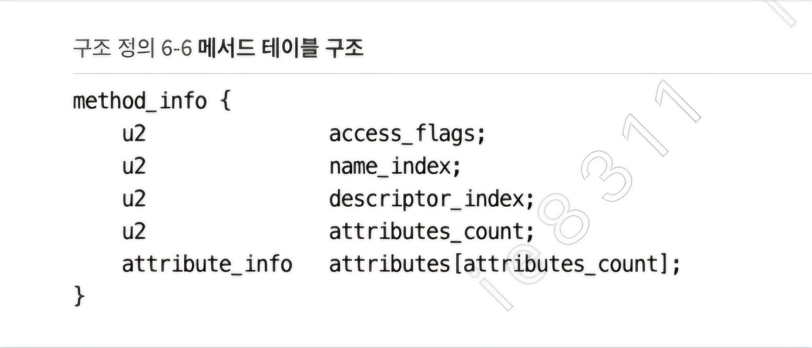

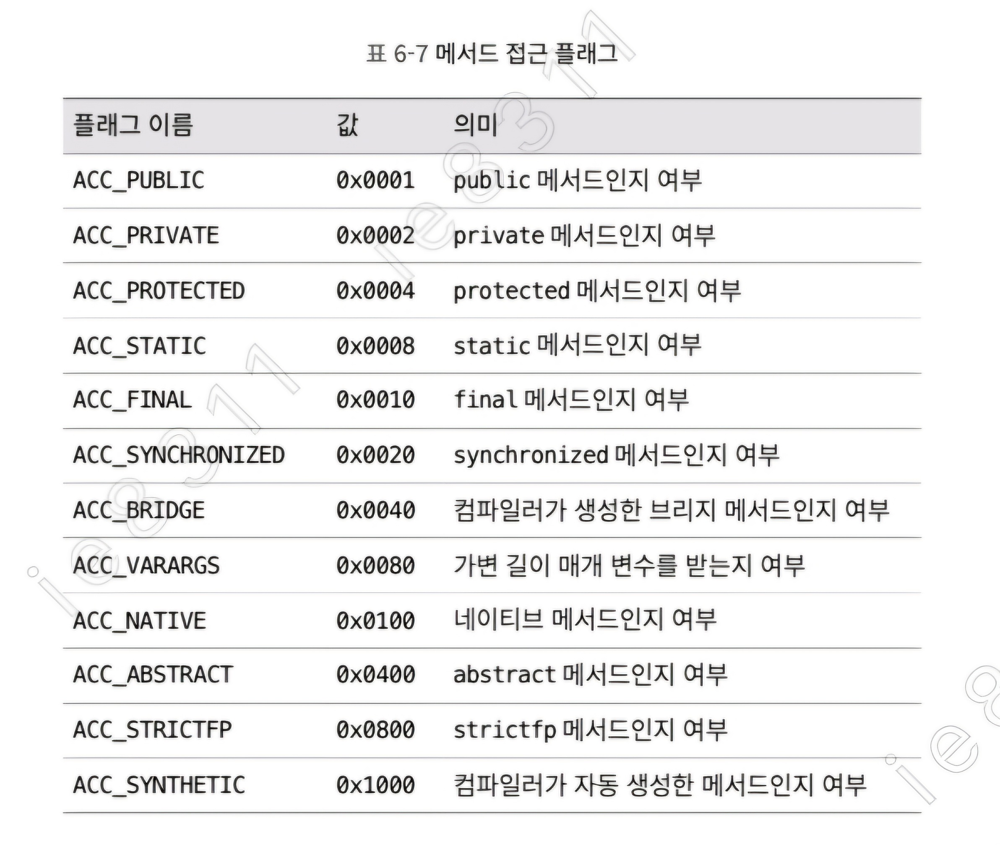

- 메서드 본문 코드
    - javac 컴파일러에 의해 바이트코드 명령어로 변환된 후,
    - 메서드 속성 테이블 컬렉션의 `Code` 속성에 저장된다.
- 메서드 오버로딩
    - 자바 언어에서는…
        - 메서드 시그니처에 반환값이 포함되지 않기 때문에, 반환값만 다르게 하는 메서드 오버로딩은 불가능
    - 클래스 파일에서는…
        - 디스트립터가 완전히 같지 않다면 (반환값만 다르더라도) 두 메서드가 공존할 수 있다.
        - (so what…?)

## 6.3.7 속성 테이블

- `attribute_info`
- 클래스 파일의 다른 항목들은 순서, 길이, 내용을 엄격하게 지켜야 하는 반면, 속성 테이블은 제약이 약하다.
- 속성 이름은 `CONSTANT_Utf8_info` 타입 상수를 참조해서 표현한다.
- 속성값의 길이는 `u4` 타입으로 나타낸다.
- `Code` 속성
    
    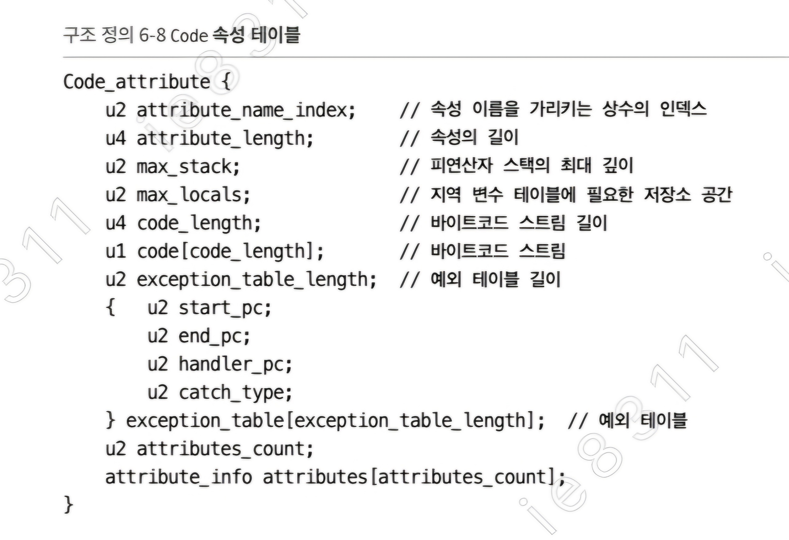
    
    - 🤔 개발자의 관점에서는 코드가 메인이지만, 클래스 파일의 관점에서는 코드가 부수적인 정보…?!
    - `attribute_name_index` : “Code” Utf8 엔트리를 가리키는 인덱스
    - `attribute_length` : Code 속성의 길이
    - `max_stack` : 피연산자 스택의 최대 깊이 (함수 호출 스택과는 다른 개념)
    - `max_locals` : 지역 변수 테이블에 필요한 저장소 공간 (지역 변수의 숫자가 아니라, 변수 슬롯의 개수)
        - 32비트가 변수 슬롯 단위. 32비트 이하의 데이터 타입은 변수 슬롯 1개, 64비트 데이터 타입은 변수 슬롯 2개를 차지한다.
        - 자바 힙에 객체를 저장할 때 효율적으로 패킹하는 것과는 달리, 스택 프레임의 지역 변수는 접근 속도를 빠르게 하는 것이 중요하기 때문.
        - 실행하는 코드가 지역 변수의 유효 범위를 벗어나면, 그 변수의 슬롯을 다른 변수에 할당한다. 따라서 동시에 존재하는 지역 변수들의 최대 슬롯 개수를 `max_locals` 크기로 잡는다.
    - `code_length` : 바이트코드 길이
        - `u4` 타입이므로, 이론적으로는 최대 2^32까지 길어질 수 있으나, JVM 명세에는 65535를 넘을 수 없다고 명시되어 있어서 사실상 `u2` 타입에 해당한다. 이 제한을 넘으면 컴파일을 거부한다.
    - `code` : 바이트코드 명령어들이 순차적으로 저장되는 바이트 스트림
        - 바이트코드 명령어 각각은 1바이트이므로, 타입은 `u1`
        - 따라서 최대 256가지 명령어를 표현할 수 있고, JVM 명세에는 약 200가지 명령어가 정의되어 있다.
        - `code` 해석 예시
            - `2A B7 00 01 B1`
            - `2A`를 읽고, 명령어 테이블에서 `2A` 에 해당하는 명령어를 찾는다.
                - `aload_0`
                - 0번째 변수 슬롯에 담긴 참조 타입 지역 변수를 피연산자 스택의 맨 위로 읽어들인다.
            - `B7`을 읽고, 명령어 테이블에서 `B7` 에 해당하는 명령어를 찾는다.
                - `invokespecial`
                - 스택 맨 위의 참조 타입 데이터가 가리키는 객체를, 메서드의 수신자로 사용하여, 해당 객체의 인스턴스 생성자나 private 메서드 또는 상위 클래스의 메서드를 호출한다.
            - invokespecial 명령어의 `u2` 매개변수로 `00 01` 를 읽는다.
                - 상수 풀에서 0x0001 번째의 상수, 즉 <init>() 메서드를 가리키는 심벌 참조임
            - `B1`을 읽고, 명령어 테이블에서 `B1` 에 해당하는 명령어를 찾는다.
                - `return`
                - 현재 메서드에서 반환되며, 반환값은 void다. (🤔 위에서 <init>()를 읽었기 때문에 알 수 있는 정보?)
            - 데이터 교환과 메서드 호출 같은 작업이 모두 피연산자 스택을 기반으로 이루어지고 있다. (?)
            - 바이트코드 분석
                - `args_size`
                    - 인스턴스 메서드의 매개 변수 수는 최소 1
                        - 현재 객체의 인스턴스를 가리키는 지역변수 사용하기 때문
                    - static 메서드는 최소 0
    - `exception_table`
        - Start_pc 와 end_pc 사이에서 catch_type 또는 그 하위 예외가 발생하면 handler_pc 줄로 이동
        - catch_type이 0이면, 어떤 비정상 상황이 발생하든 handler_pc로 이동해야 함
        - try-catch-finally

- `Exceptions` 속성
- `LineNumberTable` 속성
- `LocalVariableTable`, `LocalVariableTypeTable` 속성
- `SourceFile`, `SourceDebugExtension` 속성
- `ConstantValue` 속성
- `InnerClasses` 속성
- `Deprecated`, `Synthetic` 속성
- `StackMapTable` 속성
- `Signature` 속성
- `BootstrapMethods` 속성
- `MethodParameters` 속성
- 모듈화 관련 속성
- 런타임 애너테이션 관련 속성
- `Record` 속성
- `PermittedSubclasses` 속성

---

# 6.4 바이트코드 명령어 소개

## 6.4.1 바이트코드와 데이터 타입들

- 대부분의 명령어는, 데이터 타입을 뜻하는 문자로 시작한다.
    - 즉, 명령어 자체에 연산에 필요한 데이터의 타입이 표시되어 있다.
    - 예시)
        - `load` : int 타입 사용
        - `fload` : float 타입 사용
    - 예외)
        - `arraylength`, `goto`
- 전용 명령어가 없는 타입은, 별도의 지시문을 이용해서 지원되는 타입으로 변환해서 사용한다.

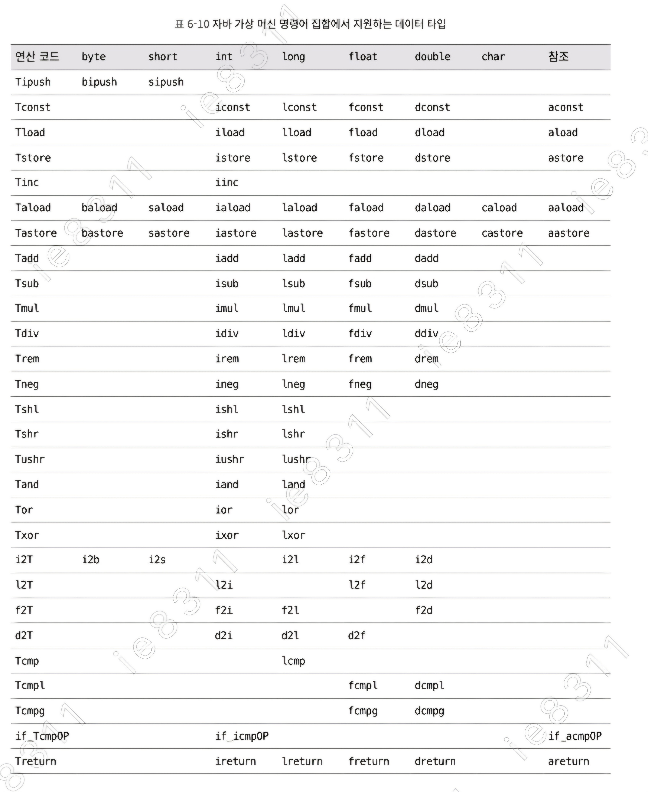

## 6.4.2 로드와 스토어 명령어

(JVM 런타임 데이터 영역 복습)

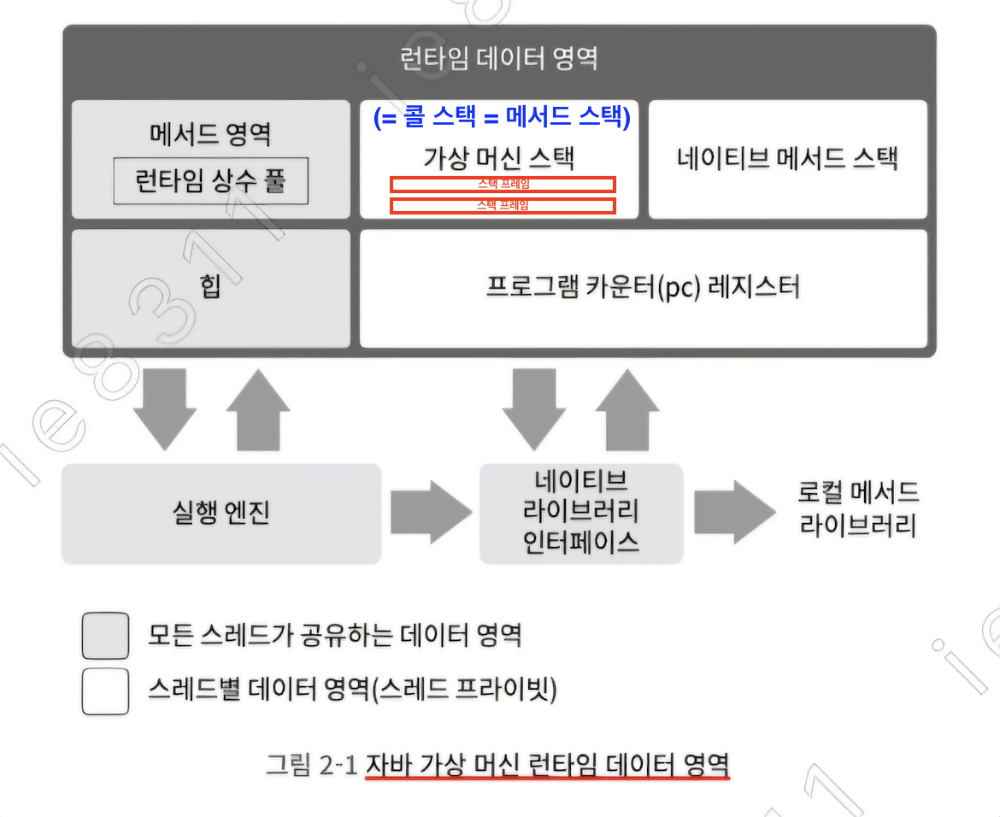

- 스택 프레임의 지역 변수 테이블과 피연산자 스택 사이에서 데이터를 주고받는 데 쓰임
- 지역 변수 → 피연산자 스택으로 읽기
    - `Tload` , `Tload_<n>`
- 피연산자 스택 → 지역 변수 테이블에 저장
    - `Tstore` , `Tstore_<n>`
- 상수 → 피연산자 스택으로 읽기
    - `Tipush`
    - ldc, ldc_w, ldc2_w
    - `Tconst`